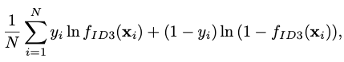

# Decision tree learning
Considering ID3 learning algorithm.

It maximises the average log-likelihood, 

Is non-parametric. 

[[Random forest]].

Q. What is the objective function at node-splitting for a decision tree algorithm?
A. Minimise entropy

Q. What does entropy mean in math?
A. The amount of uncertainty about a random variable

Q. When is entropy maximal in math?
A. All values are equally probable

Q. When is entropy minimal in math?
A. Only one value is possible

Q. When does a decision tree stop splitting nodes?
A. No more examples, no more attributes, improvement below threshold, maximum depth reached

Q. What is the maximum depth of a decision tree?
A. Infinite, set by experimenter

Q. What is the threshold for improvement for a decision tree node split?
A. 0, set by experimenter

## Backlinks
* [[§Machine Learning]]
	* [[Decision tree learning]]

<!-- #anki/tag/machine-learning -->

<!-- {BearID:FB025A44-1E52-445E-935C-36CC32C507A7-2200-00000B07FDFDBEFB} -->
