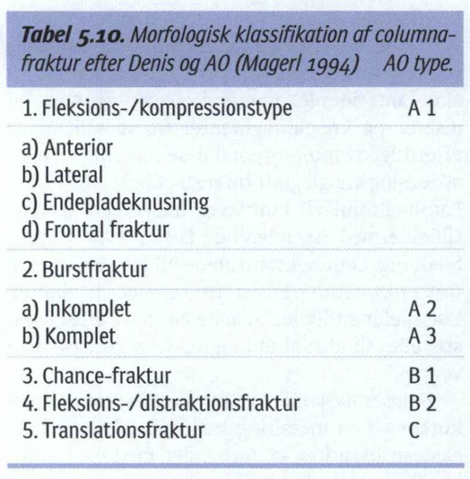
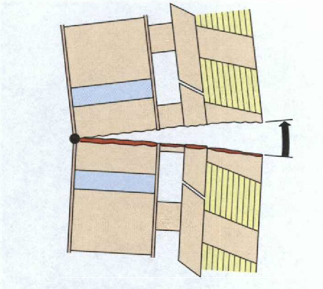

# Denis-klassifikationen
## Generelt

Q. Hvilket system bruges i sundhedsvæsenet til klassifikation af *[[Columnafraktur]]*? 
A. *[[Denis-klassifikationen]]*

Q. Hvad bruges *[[Denis-klassifikationen]]* til i sundhedsvæsenet? 
A. Klassifikation af *[[Columnafraktur]]* 

Q. Beskriv klassifikationen af *[[Columnafraktur]]* i sundhedsvæsenet. 
A. [[Denis-klassifikationen]]: Anterior columna, midterste columna, bagerste columna

Q. Hvad indgår i den midterste columna i [[Denis-klassifikationen]]?
A. Bagerst corpora + lig. longitudinale post.

Q. Hvornår er frakturer især ustabile udfra [[Denis-klassifikationen]]?
A. Hvis midterste søjle er afficeret

Q. Hvad ses her?

A. En [[Chance-fraktur]]

## Differentialdiagnose

## Udredning
### Anamnese

### Objektiv us.

### Paraklinik

## Behandling

## Opfølgning

## Prognose
 

## Backlinks
* [[Columnafraktur]]
	* [[Denis-klassifikationen]]
* [[Denis-klassifikationen]]
	* Q. Hvilket system bruges i sundhedsvæsenet til klassifikation af *[[Columnafraktur]]*? 
	* Q. Hvad bruges *[[Denis-klassifikationen]]* til i sundhedsvæsenet? 
	* Q. Beskriv klassifikationen af *[[Columnafraktur]]* i sundhedsvæsenet. 

	* Q. Hvad indgår i den midterste columna i [[Denis-klassifikationen]]?
	* Q. Hvornår er frakturer især ustabile udfra [[Denis-klassifikationen]]?

<!-- #anki/tag/med/Orto #anki/deck/Medicine -->

<!-- {BearID:22706CA7-1B6B-4E1D-9805-08BB58346A32-20440-000030611FA28B93} -->
