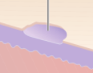

# Dermatologisk terminologi
[[Morfologi]], [[Erytem]]

Q. Hvilke overordnede elementer indgår i beskrivelsen af et exanthem?
A. Placering, farve og [[Morfologi]] 

Q. Hvad menes i dermatologi med *macula*?
A. Ikke-infiltreret plet i huden

Q. Hvordan adskiller en *macula* sig fra en *papel*?
A. En *papel* er infiltreret, det er en *macula* ikke

Q. Hvad menes i dermatologi med *papel*?
A. Infiltreret forandring < 5 mm i huden

Q. Hvad menes i dermatologi med *nodulus*?
A. Infiltreret forandring > 5 mm i huden

Q. Hvad menes i dermatologi med *plaque*?		
A. Større fladeformet, eleveret forandring i huden

Q. Hvad menes i dermatologi med *tumor*?
A. Velafgrænset abnorm struktur

Q. Hvad menes i dermatologi med *kvadel*?
A. Hævelse i huden

Q. Hvad menes i dermatologi med *hyperkeratose*?
A. Kraftig horndannelse

Q. Hvad menes i dermatologi med *crusta*?
A. Skorpedannelse

Q. Hvad menes i dermatologi med *ekskoriation*?
A. Substanstab pga. krads

Q. Hvad menes i dermatologi med *lichen*?
A. Flad, ca. 5 mm stor papel

Q. Hvad menes i dermatologi med *lichenisering*?
A. Fortykkelse af huden pga. krads

Q. Hvad menes i dermatologi med *skæl*?
A. Synlig afstødning af hornlaget

Q. Hvad menes i dermatologi med *vesikel*?
A. Væskefyldt blære < 5 mm

Q. Hvad menes i dermatologi med *bulla*?
A. Væskefyldt blære > 5 mm

Q. Hvad menes i dermatologi med *pustel*?
A. En pusfyldt vesikel

Q. Hvad menes i dermatologi med *erosion*?
A. Overfladisk substanstab

Q. Hvad menes i dermatologi med *ulcus*?
A. Et sår

Q. Hvad hedder en *ikke-infiltreret plet i huden* i derma?
A. *Macula*

Q. Hvad hedder en *infiltreret forandring < 5 mm i huden* i derma?
A. *Papel*

Q. Hvad hedder en *infiltreret forandring > 5 mm i huden* i derma?
A. *Nodulus*

Q. Hvad hedder en *større fladeformet, eleveret forandring i huden* i derma?
A. *Plaque*	

Q. Hvad hedder en *velafgrænset abnorm struktur* i derma?
A. *Tumor*	

Q. Hvad hedder en *hævelse i huden* i derma?
A. *Kvadel*

Q. Hvad hedder en *kraftig horndannelse* i derma?
A. *Hyperkeratose*

Q. Hvad hedder en *skorpedannelse* i derma?
A. *Crusta*

Q. Hvad hedder et *substanstab pga. krads* i derma?
A. *Ekskoriation*

Q. Hvad hedder en *flad, ca. 5 mm stor papel* i derma?
A. *Lichen*

Q. Hvad hedder en *fortykkelse af huden pga. krads* i derma?
A. *Lichenisering*

Q. Hvad hedder en *synlig afstødning af hornlaget* i derma?
A. *Skæl*

Q. Hvad hedder en *væskefyldt blære < 5 mm* i derma?
A. *Vesikel*

Q. Hvad hedder en *væskefyldt blære > 5 mm* i derma?
A. *Bulla*

Q. Hvad hedder en *pusfyldt vesikel* i derma?
A. *Pustel*

Q. Hvad hedder et *overfladisk substanstab* i derma?

A. *Erosion*

Q. Hvad hedder et *sår* i derma?
A. *Ulcus*

Q. Hvad menes i dermatologi med *exanthem*? 
A. *Udslæt* (af enhver type)

Q. Hvad hedder *udslæt (af enhver type)* i derma?
A. *Exanthem* 

Q. Et udslet er brunligt i huden. Hvilke stoffer kan forårsage farven?
A. Melanin eller hæmosiderin

Q. Hvad menes i dermatologi med *purpura*? 
A. *Rødme pga. blødning i huden*

Q. Hvad hedder *rødme pga. blødning i huden* i derma? 
A. *Purpura* 

Q. Hvordan adskilles erytem fra purpura?
A. Erytem svinder ved tryk, det gør purpura ikke

Q. Hvad menes i dermatologi med *akralt*? 
A. *Perifære forandringer*

Q. Hvad hedder *perifære forandringer* i derma? 
A. *Akrale forandringer* 

Q. Hvad menes i dermatologi med *annulært*? 
A. *Ringformet*

Q. Hvad hedder *ringformet* i derma? 
A. *Annulært* 

Q. Hvad menes i dermatologi med *arkuat*? 
A. *Bueformet*

Q. Hvad hedder *bueformet* i derma? 
A. *Arkuat* 

Q. Hvad menes i dermatologi med *centrifugalt*? 
A. *Udadspredende (fra et centrum)*

Q. Hvad hedder *udadspredende (fra et centrum)* i derma? 
A. *Centrifugalt* 

Q. Hvad menes i dermatologi med *circinat*? 
A. *”Bobbel-afgrænset"*

Q. Hvad hedder *"bobbel-afgrænset"* i derma? 
A. *Circinat* 

Q. Hvad menes i dermatologi med *diskoid*? 
A. *Skiveformet*

Q. Hvad hedder *skiveformet* i derma? 
A. *Diskoid* 

Q. Hvad menes i dermatologi med *nummulat*? 
A. *Med mønt-størrelse*

Q. Hvad hedder *med mønt-størrelse* i derma? 
A. *Nummulat* 

Q. Hvad menes i dermatologi med *poikiloderma*? 
A. *Vesklende hypo- og hyperpigmenteret med telangieektasier*

Q. Hvad hedder *vesklende hypo- og hyperpigmenteret med telangieektasier* i derma? 
A. *Poikiloderma* 

Q. Hvad menes i dermatologi med *retikulært*? 
A. *Netagtigt mønster*

Q. Hvad hedder *netagtigt mønster* i derma? 
A. *Retikulært* 

Q. Hvad menes i dermatologi med *serpiginøst*? 
A. *Formet som slanger*

Q. Hvad hedder *formet som slanger* i derma? 
A. *Serpiginøst* 

<!-- #anki/tag/med/Derma #anki/deck/Medicine -->

<!-- {BearID:3C707B68-0352-4346-926D-0FFEB02E4F82-24378-0000EDE45D95591C} -->
