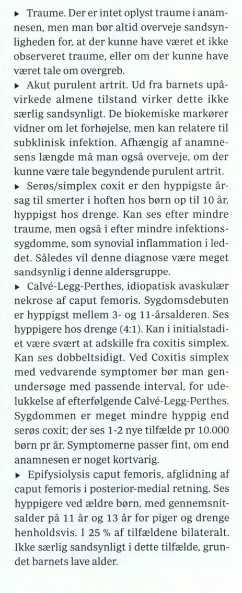
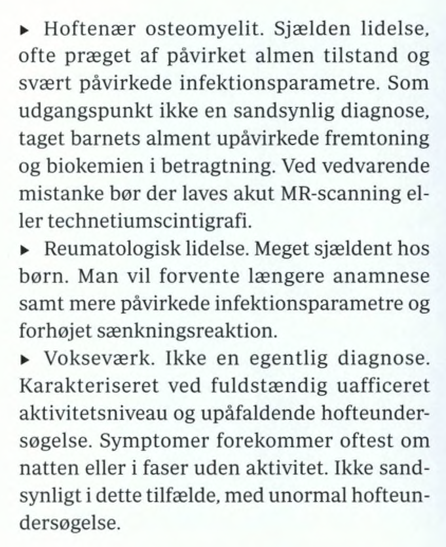
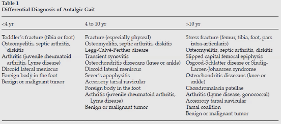

# Det haltende barn
## Generelt
[[Udvikling af gang hos børn]]

## Differentialdiagnose

DDH er hoftedysplasi.

[[Hoftedysplasi]]
[[Hofteluksation]]

[[Coxitis simplex]]/Transient synovitis

[[Mb. Calve-Legg-Perthe]]

[[Hofteepifysiolyse]]

[[Septisk artrit]]

[[Akut appendicitis]]

## Udredning
### Anamnese
Q. Din patient viser symptomer på [[Det haltende barn]]. Hvad skal tilføjes *anamnesen*? 
A. 1) Traume/forstrækning, 2) Natlige smerter, 3) [[B-symptomer]]

Q. Din patient siger de har ondt i knæet. Hvor findes genesen typisk?
A. 1) Hofte eller 2) Knæ

### Objektiv us.
Q. Hvordan kan du adskille, om et barn der ikke kan tale har ondt i ryg eller hofte?
A. Bed barnet samle noget op – squat er ryg, bøje er hofte.

Q. Din patient er [[Det haltende barn]]. Hvad vil du tilføje *den objektive us.*? 
A. 1) Inspektion, 2) Palpation, 3) Funktion: Aktiv/passiv bevægelighed, reflekser, [[Trendelenburgs test]], [[Galeazzis tegn]]

### Paraklinik
Q. Hvornår vil du tage rtg. for [[Det haltende barn]]?
A. 1) Mistanke om fraktur, 2) Ikke noget oplagt traume

## Behandling

## Opfølgning

## Prognose
 

## Backlinks
* [[Det haltende barn]]
	* Q. Din patient viser symptomer på [[Det haltende barn]]. Hvad skal tilføjes *anamnesen*? 
	* Q. Din patient er [[Det haltende barn]]. Hvad vil du tilføje *den objektive us.*? 
	* Q. Hvornår vil du tage rtg. for [[Det haltende barn]]?

<!-- #anki/tag/med/Orto #anki/deck/Medicine #anki/tag/med/GP -->

<!-- {BearID:994BAF64-FB64-4C1C-AAEB-39CCB2736E7A-819-0000024ADEBC2460} -->
