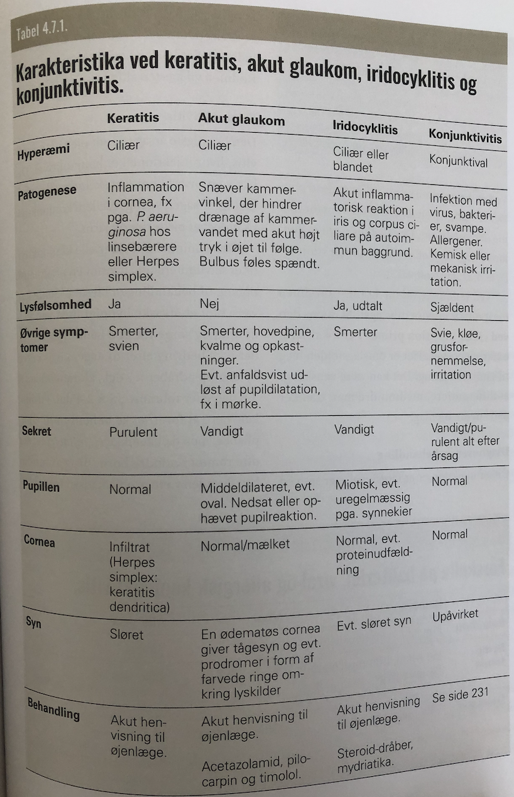

# Det røde øje
## Generelt
Klart hyppigst [[Conjunctivitis]]. 

## Differentialdiagnose

Q. Hvad er de primære differentialdiagnoser til [[Det røde øje]]?
A. 1) [[Conjunctivitis]], 2) [[Keratitis]], 3) [[Iridocyklitis]], [[Subkonjunktival blødning]] og 5) [[Akut glaukom]]

## Udredning
### Anamnese
Q. Hvad vil du spørge om til S *O* CRATES for [[Det røde øje]] 
A. 1) Komorbiditeter, 2) Svejsning/arbejde med metal, 3) Kontaktlinsebrug

Q. Hvad vil du spørge om til SOCR *A* TES for [[Det røde øje]] 
A. 1) Hovedpine, 2) Synspåvirkning, 3) Lysskyhed, 4c) Pussekretion

### Objektiv us.
Q. Din patient viser symptomer på [[Det røde øje]]. Hvad vil du tilføje *den objektive us.*? 
A.  1) Konjunktival-, ciliær- eller blandingsinjektion, 2) Inspicer for pupilform, størrelse og lysreaktion, 3) H-konfiguration, 4) Synsfeltsus.

### Paraklinik

## Behandling

## Opfølgning

## Prognose

## Backlinks
* [[Det røde øje]]
	* Q. Hvad er de primære differentialdiagnoser til [[Det røde øje]]?
	* Q. Hvad vil du spørge om til S *O* CRATES for [[Det røde øje]] 
	* Q. Hvad vil du spørge om til SOCR *A* TES for [[Det røde øje]] 
	* Q. Din patient viser symptomer på [[Det røde øje]]. Hvad vil du tilføje *den objektive us.*? 

<!-- #anki/tag/med/gp #anki/deck/Medicine #anki/tag/med/Ophthalmology -->

<!-- {BearID:757C021A-3603-47C3-A6A9-1BF608DF4CBA-3994-000006BFCF5F9E5A} -->
