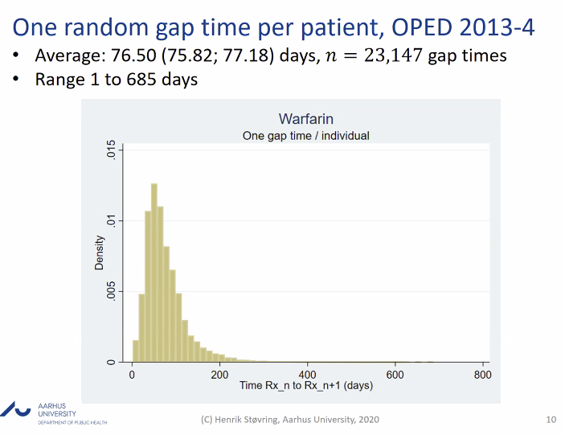
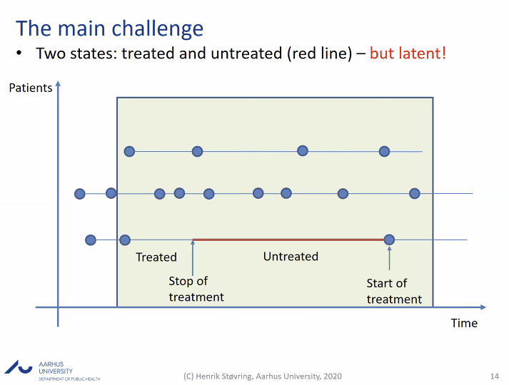
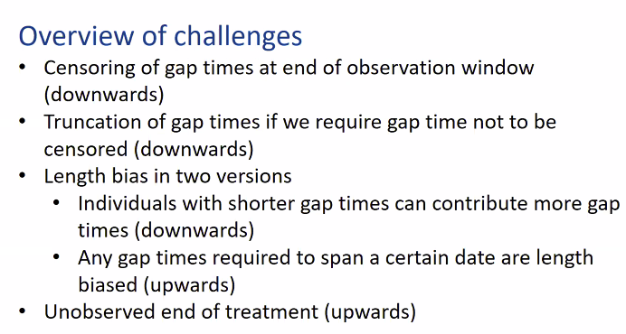

# Determining prescription durations based on the parametric waiting time distribution
We’re trying to estimate how long someone has had a medication prescribed, since this information is not in the Danish lægemiddeldatabase.

* How can the random gat time have a range up to 685 days, if it’s only the 2013-2014 data, oh, 2-year period

<!-- {BearID:AA2E8CCA-C425-4A6B-BD82-221A0C088F78-2458-000012DADF779AA5} -->
