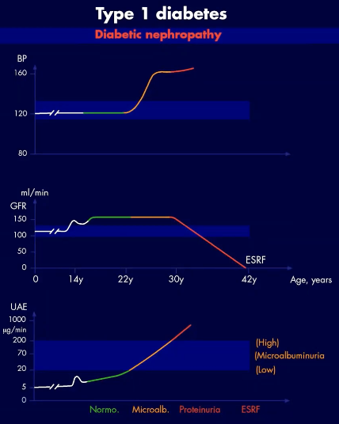

# Diabetisk nefropati
[Type 1 Diabetes - Dansk Endokrinologisk Selskab](https://endocrinology.dk/nbv/diabetes-melitus/type-1-diabetes-mellitus/)
[Type 2 Diabetes - Dansk Endokrinologisk Selskab](https://endocrinology.dk/nbv/diabetes-melitus/behandling-og-kontrol-af-type-2-diabetes/)

## Generelt
Starter med [[Mikroalbuminuri]].

## Differentialdiagnose
Q. Hvordan diagnosticeres diabetisk nefropati biokemisk?
A. Diabetes + 2 ud af 3 målinger med enten 1) Over 300 mg. pr. døgn albumin i urin eller 2) albumin:kreatinin ratio over 300 mg pr. g.

Q. Hvordan diagnosticeres diabetisk nefropati uden biokemi?
A. Diabetisk retinopati + fravær af anden nyresygdom

Q. Din patient med diabetes har fået forhøjet protein i urinen. Under hvilke omstændigheder skal man mistænke, at det er af en anden årsag end diabetes?
A. 1) Pludselig, stor stigning, 2) Fravær af retinopati

## Udredning
Q. På hvilke måder kan diabetisk nefropati overordnet diagnosticeres?
A. Biokemisk eller klinisk

### Anamnese

### Objektiv us.

### Paraklinik

## Behandling
Q. Hvilke overordnede “arme” er der for behandling af diabetisk nefropati?
A. Farmakologi + diæt

Q. Hvilken medicin skal en pt. med diabetisk nefropati have?
A. 1) Optimering af Glc (gerne [[SGLT-2 hæmmere]]), 2) [[ACE-hæmmer]], 3) Yderligere BT-behandling til < 125/75, 4) Statin + ASA pga. hjertekarsygdom

Q. Hvordan behandles diabetisk nefropati med diæt?
A. Nedsat natrium + protein

## Opfølgning
Q. Hvornår henvises til nefrologisk afdeling ved diabetisk nefropati?
A. Enten 1) Dårligt kontrolleret BT, 2) eGFR ≤ 30

## Prognose

## Backlinks
* [[Diæt ved T1D]]
	* Q. Hvilke faktorer ved diæten anbefales monitoreret ved T1D?
* [[Komplikationer ved diabetes (T1D/MODY/T2D)]]
	* [[Diabetisk retinopati]]
[[Diabetisk neuropati]]

<!-- #anki/tag/med/Endocrinology #anki/deck/Medicine #anki/tag/med/Nephrology -->

<!-- {BearID:A5ED5C32-4B5B-4E26-83CA-A072C2F1CB65-15088-0000CD8DC4CF3238} -->
