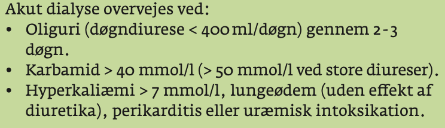

# Dialyse
## Generelt

## Differentialdiagnose

## Udredning
### Anamnese

### Objektiv us.

### Paraklinik

## Behandling

## Opfølgning

## Prognose
 

<!-- #anki/deck/Medicine# #anki/tag/med/Nephrology -->

<!-- {BearID:C9DFDCA3-C0AF-4884-833A-A128E5956D02-15714-00003649F3D1545C} -->
