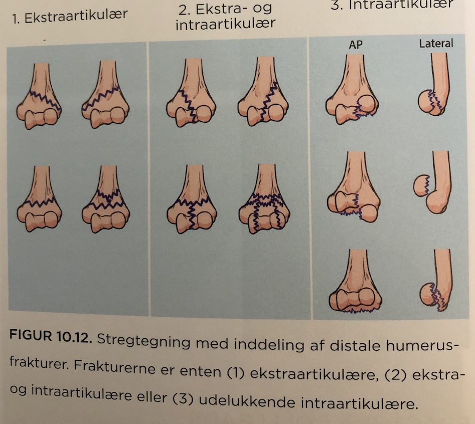

# Distal humerusfraktur hos voksne
## Generelt

## Differentialdiagnose

## Udredning
### Anamnese

### Objektiv us.

### Paraklinik

## Behandling
Alt efter kompleksitet, ofte osteosyntese.

## Opfølgning

## Prognose
 

## Backlinks
* [[§Albue]]
	* [[Distal humerusfraktur hos voksne]]

<!-- #anki/tag/med/Orto #anki/deck/Medicine -->

<!-- {BearID:44A5FBD6-79C1-4D5A-B2E3-74388761E3C9-31003-00006CCDEC4B6704} -->
