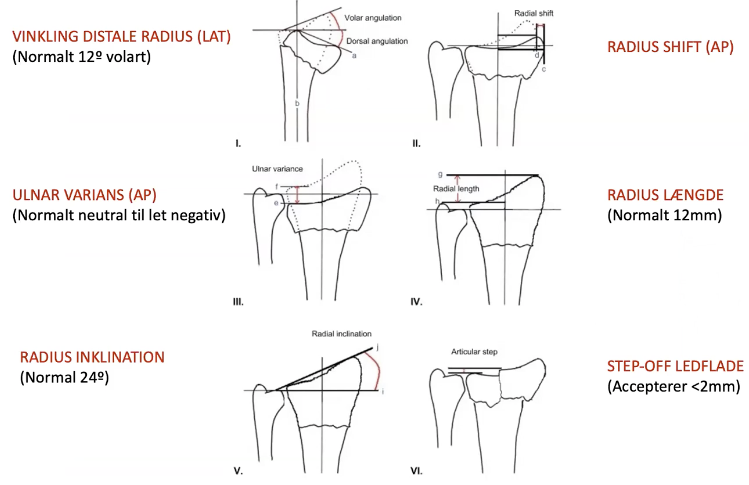
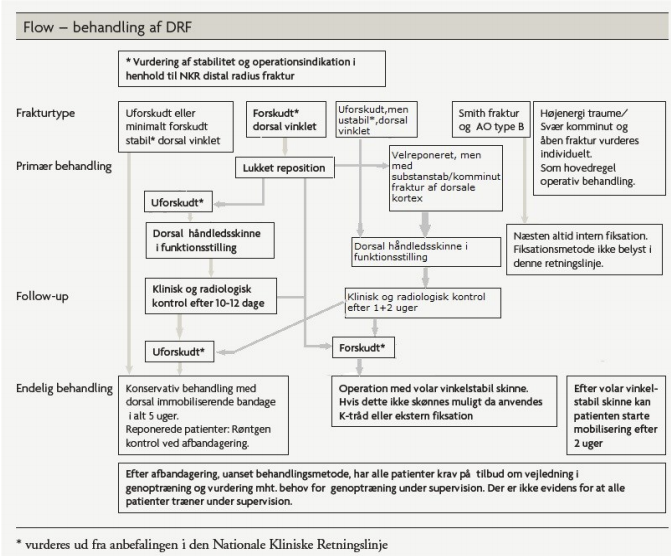

# Distal radius-fraktur
## Generelt
[[Normalanatomi i håndleddet]]

Q. Hvilke [[Distal radius-fraktur]]-typer kender vi?
A. [[Colles fraktur]], [[Smiths fraktur]], [[Bartons fraktur]], [[Chauffeurs fraktur]]

Q. Hvordan adskiller de forskellige typer [[Distal radius-fraktur]] sig fra hinanden?
A. [[Colles fraktur]]: Distalt fragment dorsalt. [[Smiths fraktur]]: Distalt fragment volart. [[Bartons fraktur]]: Frakturlinjen går gennem ledlinjen. [[Chauffeurs fraktur]]: Proc. styloideii radii.

## Differentialdiagnose

## Udredning
### Anamnese

### Objektiv us.

### Paraklinik

## Behandling
Q. Hvilke indikatorer ved en [[Distal radius-fraktur]] giver OP-indikation?
A. Hvis *efter reponering* enten 1) Ledspring mere end 2 mm, 2) Ulnar varians mere end 2 mm, 3) Inkongruens af distalt radioulnart led, 4) Ledfladen mere end 10 grader dorsiflekteret, 5) Komminut fraktur af dorsal kortex i distal radius

Distal radiusfraktur.

Husk compliance!

## Opfølgning
Q. Hvad er opfølgningen af en reponeret [[Distal radius-fraktur]]?
A. Kontrolrtg. 10-12 dage.

## Prognose
Q. Hvad er specielle komplikationer til en volarskinne for en [[Distal radius-fraktur]]?
A. 1) Fleksorseneruptur, 2) ekstensorseneruptur, 3) [[Karpaltunnelsyndrom]]

Q. Du skal afbandagere et håndled efter en [[Distal radius-fraktur]]. Hvad vil du gøre?
A. 1) Afbandager, 2) Tjek neurovaskulære forhold

## Backlinks
* [[Distal radius-fraktur]]
	* Q. Hvilke [[Distal radius-fraktur]]-typer kender vi?
	* Q. Hvordan adskiller de forskellige typer [[Distal radius-fraktur]] sig fra hinanden?
	* Q. Hvilke indikatorer ved en [[Distal radius-fraktur]] giver OP-indikation?
	* Q. Hvad er opfølgningen af en reponeret [[Distal radius-fraktur]]?
	* Q. Hvad er specielle komplikationer til en volarskinne for en [[Distal radius-fraktur]]?

	* Q. Du skal afbandagere et håndled efter en [[Distal radius-fraktur]]. Hvad vil du gøre?
* [[Colles fraktur]]
	* Se [[Distal radius-fraktur]].
* [[Smiths fraktur]]
	* Se [[Distal radius-fraktur]].
* [[§Håndled]]
	* [[Distal radius-fraktur]]
	[[Smiths fraktur]]
	[[Bartons fraktur]]
	[[Chauffeurs fraktur]]
* [[Bartons fraktur]]
	* Se [[Distal radius-fraktur]].

<!-- #anki/tag/med/Orto #anki/deck/Medicine -->

<!-- {BearID:0FFE0F42-88ED-405B-B17C-00A3A6C23774-3348-000003F06F85D6B8} -->
