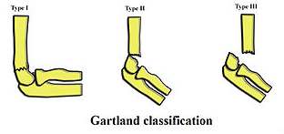

# Distal suprakondylær humerusfraktur i børn
Fractura supracondyloidea humeri.

## Generelt
Smerter nær [[§Albue]]. 60% af albuefrakturer i børn.

3% får problemer med [[a. brachialis]].

[[Gartland klassifikationen]]

## Differentialdiagnose

## Udredning
### Anamnese

### Objektiv us.

### Paraklinik

## Behandling
Q. Hvordan behandles [[Distal humerusfraktur hos børn]]?
A. 1) Reposition i gennemlysning, 2) K-tråde, 3) Gips i 90 grader i 4 uger

## Opfølgning
Skader under traume: [[n. interosseus ant.]]
Skader under OP: [[n. ulnaris]]

## Prognose
 
 
## Backlinks
* [[§Albue]]
	* [[Distal suprakondylær humerusfraktur i børn]]
* [[Gartland klassifikationen]]
	* Q. Hvad menes i sundhedsvæsenet med *[[Gartland klassifikationen]]*? 
	* Q. Hvad bruges i sundhedsvæsenet til *Klassifikation af [[Distal suprakondylær humerusfraktur i børn]]*? 
	* Q. Beskriv en klassifikation af [[Distal suprakondylær humerusfraktur i børn]].

* [[§Overarm]]
	* [[Proksimal humerusfraktur]]

<!-- #anki/tag/med/Orto #anki/deck/Medicine -->

<!-- {BearID:3CD9791F-B7C5-4A0B-9032-F42541A4846D-31003-00006B3EEB5CB1CC} -->
