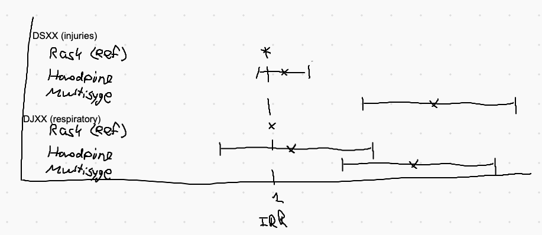

# Do NSS-clusters increase hospital contacts for a given diagnosis?
Does the association between a diagnosis and number of contacts differ between NSS-clusters?

To explore this, we need some of the prototypical high-contact diagnoses. These are general lesions (S), allergic conditions (J) etc.

We could group diagnoses by category + 1 sub-number (eg. S6/A5 etc.), and then report the top 10 most frequent in our sample.

It can be represented by a diagnosis-group x cluster forest-plot:

This would be super interesting! It would indicate that symptom-clusters are indicators of general ill-being – ie. if you have more accidents, that’s super weird! 

It’s something we’d have to look into – potentially that multiple non-specific symptoms would be indicators of abuse or neglect. 

<!-- #work/research-idea/2. shapeable# -->

<!-- {BearID:B85D4834-1080-425B-9563-27455CE8C8A0-961-000005390DE1966F} -->
