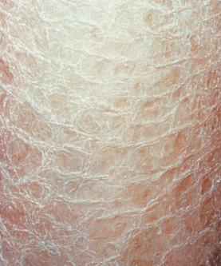

# Eczema craquelee
Også kendt som asteatotisk eksem.

Q. Hvad menes i dermatologi med *[[Eczema craquelee]]*? 
A. *Krakellerende tør hud*

Q. Hvad hedder *Krakellerende tør hud* i derma? 
A. *[[Eczema craquelee]]* 

Q. Hvad ses her?

A. [[Eczema craquelee]]

Q. Hvilke faktorer udløser hyppigst [[Eczema craquelee]]?
A. Lav luftfugtighed eller hyppig badning

Q. Hvor ses hyppigst [[Eczema craquelee]]?
A. Truncus og ekstremiteternes ekstensorsider

Q. Hvordan behandles [[Eczema craquelee]]?
A. 1) Fugtighedscreme, 2) Skåne hud for vask, 3) I korte perioder mild steroid

## Backlinks
* [[Eczema craquelee]]
	* Q. Hvad menes i dermatologi med *[[Eczema craquelee]]*? 
	* Q. Hvad hedder *Krakellerende tør hud* i derma? 
	* Q. Hvad ses her?
A. [[Eczema craquelee]]
	* Q. Hvilke faktorer udløser hyppigst [[Eczema craquelee]]?
	* Q. Hvor ses hyppigst [[Eczema craquelee]]?
	* Q. Hvordan behandles [[Eczema craquelee]]?
* [[Dermatitis]]
	* [[Eczema craquelee]]
[[Lichen simplex chronicus]]
	[[Perianal dermatitis]]

<!-- #anki/tag/med/Derma #anki/deck/Medicine -->

<!-- {BearID:B345D13C-AB7E-4A75-8292-E0B04F458D88-43570-00004BEC8558CAD8} -->
