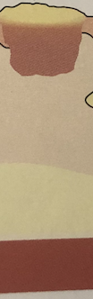

# Ektyma
Q. Hvilken type infektion ses her?

A. [[Ektyma]]

Q. Hvad menes i dermatologi med *[[Ektyma]]*? 
A. *Impetigo + dyb, purulent infektion*

Q. Hvad hedder *impetigo + dyb, purulent infektion* i derma? 
A. *[[Ektyma]]* 

Q. Hvordan behandles [[Ektyma]]?
A. Mild og lokal) Klorhexidin 1%. Mere udrbedt) Systemisk [[Dicloxacillin]]. (Dvs. som [[Impetigo]]).

## Backlinks
* [[Ektyma]]
	* Q. Hvilken type infektion ses her?
A. [[Ektyma]]
	* Q. Hvad menes i dermatologi med *[[Ektyma]]*? 
	* Q. Hvad hedder *impetigo + dyb, purulent infektion* i derma? 
	* Q. Hvordan behandles [[Ektyma]]?
* [[Infektioner i huden]]
	* [[S. aureus]]
	[[SSSS]]
	[[Erysipelas]]
	[[Ektyma]]
	[[Follikulitis]]
		[[Furunkel]]
			[[Karbunkel]]
	[[Cellulitis]]
	[[Nekrotiserende fasciitis]]

<!-- #anki/tag/med/Derma #anki/deck/Medicine #anki/tag/med/Infectious -->

<!-- {BearID:3DB16A92-ED1A-4F2F-92C8-BF147EC812C6-43570-0000512F61B9D9FE} -->
