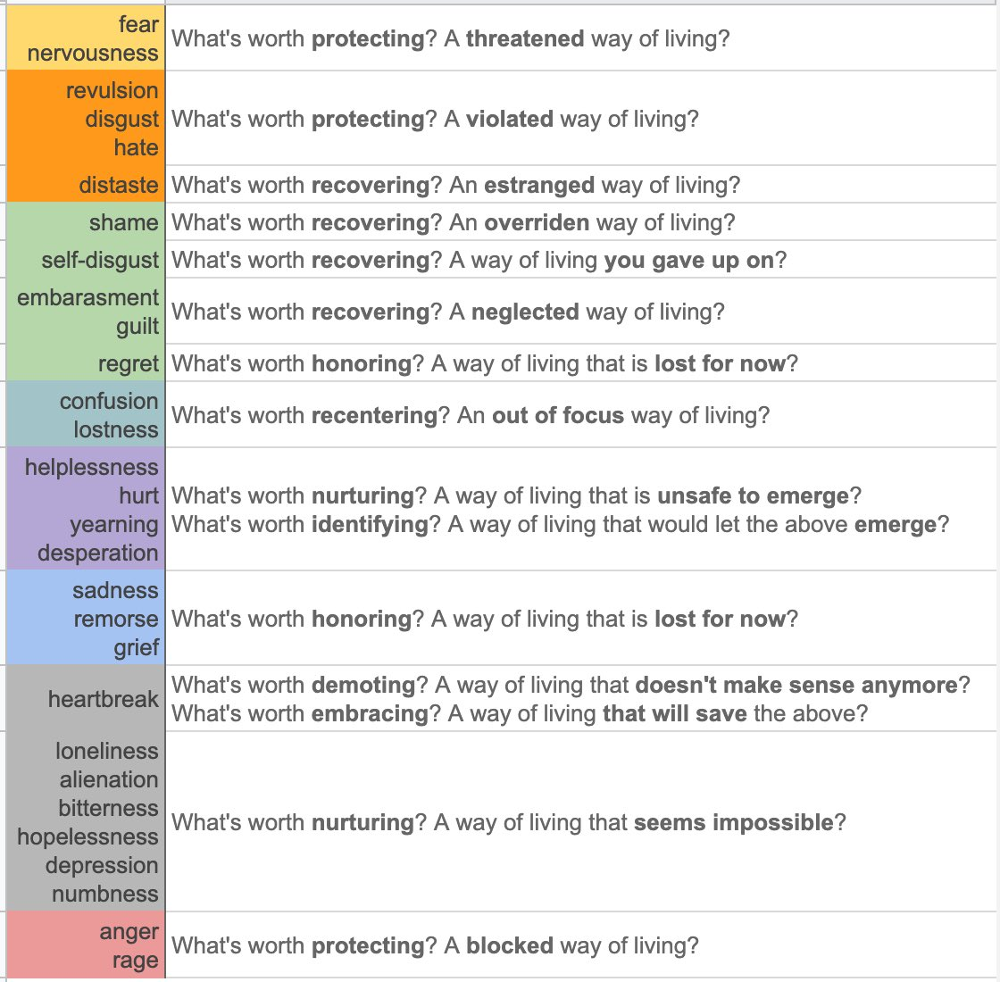

# Emotions are emergent heuristics about actions for values

[[§Fear]]
[[§Nervousness]]
[[§Shame]]
[[§Anger]]
[[§Annoyance]]
[[§Confusion]]
[[§Yearning]]
[[§Sadness]]
[[§Grief]]
[[§Heartbreak]]
[[§Loneliness]]
[[§Depression (concept)]]

I might want to think more about these emotions, elaborate on them in my own terms, think about which actions to take when encountering them, and make flashcards of them.

## Backlinks
* [[Take action on your values to live a meaningful life]]
	* Isn't this a bit too structured, though? [[Structure is necessary for a meaningful life]], but that doesn't mean that we completely neglect our emotions. Instead, [[§Clarify your values to know which actions to take]] by using that [[Your long-term emotions inform your values]], [[Emotions are emergent heuristics about actions for values]].
* [[§Emotions]]
	* [[Emotions are emergent heuristics about actions for values]], just like more broadly, [[Intuition is emergent heuristics]].
* [[Purpose should be salient when emotions are dysfunctional]]
	* That typically means that it makes sense to examine purpose when we either 1) have conflicting emotions, or 2) when we feel emotions ought to be salient ([[Emotions are emergent heuristics about actions for values]]).
* [[Emotions are important if they're helpful]]
	* Since [[Intuition can be fooled]], and [[Emotions are emergent heuristics about actions for values]], emotions can be fooled too.
* [[Align §Wanting, §Liking and §Approving]]
	* Probably large overlap with [[Align emotions and cognitions]], and largely that [[Emotions are emergent heuristics about actions for values]], [[Emotions are intuition that something is important]].

<!-- #p1 -->

<!-- {BearID:F48C4014-741C-49D0-B3F9-E9DA98B5DC8D-8570-000014BB1797D8D2} -->
