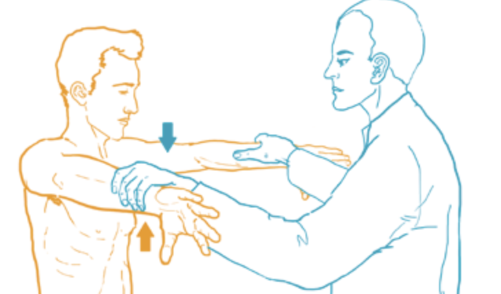

# Empty can test
Q. Beskriv en *[[Empty can test]]*.
A. 

Q. Hvad tester en *[[Empty can test]]* for?
A. *[[Supraspinatus tendinit]]*, men også rimelig aktivering af resten af rotator cuff’en

Q. Hvilken test kan bruges til at teste for *[[Supraspinatus tendinit]]*?
A. *[[Empty can test]]*, [[Painful arc]]

## Backlinks
* [[Subacromialt impingement syndrom]]
	* Q. Hvilke test kan bruges til at teste for *[[Subacromialt impingement syndrom]]*?
* [[Empty can test]]
	* Q. Beskriv en *[[Empty can test]]*.

	* Q. Hvad tester en *[[Empty can test]]* for?
	* Q. Hvilken test kan bruges til at teste for *[[Supraspinatus tendinit]]*?
* [[Undersøgelse af skulder]]
	* [[Empty can test]]
* [[Us. af skulder]]
	* Ingen painful arc, neg. [[Hawkins test]], [[Neers test]], [[Empty can test]], udadrotationstest. 

<!-- #anki/deck/Medicine #anki/tag/med/Orto -->

<!-- {BearID:7B62EE6F-46AF-494D-AF03-7076033DE0BE-15714-000037A0CE2E006D} -->
