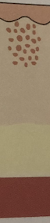

# Erysipelas
# Generelt
(Rosen)

Typisk [[S. pyogenes]].

Q. Hvilken type infektion ses her?

A. [[Erysipelas]]

Q. Hvad menes i dermatologi med *[[Erysipelas]]*? 
A. *Afgrænset overfladisk hudinfektion*

Q. Hvad hedder *afgrænset overfladisk hudinfektion* i derma? 
A. *[[Erysipelas]]* 

# Diagnose
Q. Beskriv *S* OCRATES for Erysipelas 
A. Ensidig på ekstremitet eller ansigt

Q. Beskriv S *O* CRATES for Erysipelas 
A. Timer til dage

Q. Beskriv SO *C* RATES for Erysipelas 
A. Skarpt afgrænset, højrød, varm, øm og hævet

Q. Beskriv SOCR *A* TES for Erysipelas 
A. Alment påvirker (kulderystelser)

Q. Hvordan adskiller man klinisk [[Erysipelas]] fra [[Cellulitis]]?
A. [[Erysipelas]] ligger mere overfladisk og derfor skarpere afgrænset

Q. Hvad indgår specifikt i den objektive US. ved [[Erysipelas]]?
A. 1) Kapillærrespons og krepitation (OBS [[Nekrotiserende fasciitis]], 2) Kig efter [[Atopisk dermatitis]] og [[Dermatofytose (tinea)]] som kan være indgangsporte

Q. Hvordan adskiller man klinisk [[Erysipelas]] fra [[Nekrotiserende fasciitis]]?
A. [[Erysipelas]] har 1) Færre smerter, 2) Bevaret kapillærrespons og 3) Ingen krepitation

# Behandling
Q. Hvordan behandles [[Erysipelas]]?
A. 1) Relevant AB, 2) [[ICE]] den første dag

# Opfølgning

# Prognose
<!-- #anki/tag/med/Infectious #anki/deck/Medicine #anki/tag/med/GP -->

## Backlinks
* [[Nekrotiserende fasciitis]]
	* Q. Hvilke infektiøse differentialdiagnoser findes til [[Nekrotiserende fasciitis]]?
* [[Erysipelas]]
	* Q. Hvilken type infektion ses her?
A. [[Erysipelas]]
	* Q. Hvad menes i dermatologi med *[[Erysipelas]]*? 
	* Q. Hvad hedder *afgrænset overfladisk hudinfektion* i derma? 
	* Q. Hvordan adskiller man klinisk [[Erysipelas]] fra [[Cellulitis]]?
	* Q. Hvordan adskiller man klinisk [[Erysipelas]] fra [[Cellulitis]]?
	* Q. Hvad indgår specifikt i den objektive US. ved [[Erysipelas]]?
	* Q. Hvordan adskiller man klinisk [[Erysipelas]] fra [[Nekrotiserende fasciitis]]?
	* Q. Hvordan adskiller man klinisk [[Erysipelas]] fra [[Nekrotiserende fasciitis]]?
	* Q. Hvordan behandles [[Erysipelas]]?
* [[Stasedermatitis]]
	* Q. Hvordan adskilles [[Erysipelas]] fra [[Stasedermatitis]]?
	* Q. Hvordan adskilles [[Erysipelas]] fra [[Stasedermatitis]]?
* [[Infektioner i huden]]
	* [[S. aureus]]
	[[SSSS]]
	[[Erysipelas]]
	[[Ektyma]]
	[[Follikulitis]]
		[[Furunkel]]
			[[Karbunkel]]
	[[Cellulitis]]
	[[Nekrotiserende fasciitis]]

<!-- {BearID:893BD9DF-E6F6-4D4A-869E-532A6B5A9F8A-71605-00009B0394D8DA43} -->
