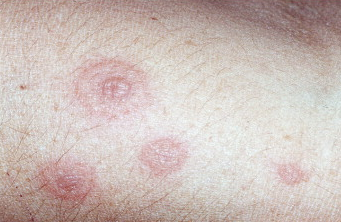

# Erythema multiforme
## Generelt
Q. Hvad er ætiologien for [[Erythema multiforme]]?
A. Reaktivt udslet, hyppigt på [[HSV]] eller [[Mycoplasma pneumoniae]]. 

## Differentialdiagnose
Q. Din patient har [[Erythema multiforme]]. Hvilke kategorier skal du mistænke?
A. Hyppigt infektion ([[HSV]], [[Mycoplasma pneumoniae]]), sjældent lægemiddelbivirkning

Q. Hvad er den hyppigste årsag til [[Erythema multiforme]] i DK?
A. [[HSV]]

* [[Toksisk erytem]]
* [[Sweets syndrom]]
* [[Pemfigoid]]

## Udredning
### Anamnese
Q. Beskriv *S* OCRATES for [[Erythema multiforme]] 
A. Symmetrisk perifært på arme, ben eller ansigt.

Q. Beskriv S *O* CRATES for [[Erythema multiforme]] 
A. I løbet af få dage.

Q. Beskriv SO *C* RATES for [[Erythema multiforme]] 
A. Kokardetegning (som en studenterhue), evt. bulla centralt. Kan være kløende.

Q. Beskriv SOCRA *T* ES for [[Erythema multiforme]] 
A. Persisterer i dage, opheler over uger.

### Objektiv us.
Q. Hvad ses her?

A. [[Erythema multiforme]]

### Paraklinik

## Behandling
Q. Hvordan behandles [[Erythema multiforme]]?
A. 1) Fjern udløsende årsag, 2) Lokal steroid, ved meget svært 3) Systemisk steroid

## Opfølgning

<!-- #anki/tag/med/Derma #anki/deck/Medicine -->

## Backlinks
* [[Urticaria]]
	* Q. Hvordan adskilles [[Urticaria]] fra [[Erythema multiforme]]?
* [[Erythema multiforme]]
	* Q. Hvad er ætiologien for [[Erythema multiforme]]?
	* Q. Din patient har [[Erythema multiforme]]. Hvilke kategorier skal du mistænke?
	* Q. Hvad er den hyppigste årsag til [[Erythema multiforme]] i DK?
	* Q. Beskriv *S* OCRATES for [[Erythema multiforme]] 
	* Q. Beskriv S *O* CRATES for [[Erythema multiforme]] 
	* Q. Beskriv SO *C* RATES for [[Erythema multiforme]] 
	* Q. Beskriv SOCRA *T* ES for [[Erythema multiforme]] 
	* Q. Hvad ses her?
A. [[Erythema multiforme]]
	* Q. Hvordan behandles [[Erythema multiforme]]?
* [[Bulla]]
	* [[Erythema multiforme]]
* [[Reaktive erytematøse sygdomme]]
	* Sygdomme med [[Erytem]]. Eg. [[Urticaria]], [[Erythema multiforme]], [[Erythema nodosum]], [[Exanthema medicamentale]], [[Toksisk epidermal nekrolyse]], [[Erythema migrans]], [[Sweets syndrom]], [[Erythema annulare centrifugum]], [[Erythema gyratum]], [[Leukocytoklasisk vaskulitis]], [[Allergisk vaskulitis]], [[Henoch-Schönleins purpura]], [[Kawasakis sygdom]], [[Erythema ab igne]]

<!-- {BearID:22D09DAC-CA01-4F14-8BC1-47599F357674-21575-000025F49685AD61} -->
