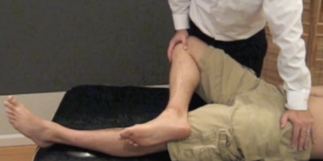

# Fabers test
Q. Beskriv en *[[Fabers test]]*.
A. 

Q. Hvad tester en *[[Fabers test]]* for?
A. *[[SI- eller hoftesmerter]]*

Q. Hvilken test kan bruges til at teste for *[[SI- eller hoftesmerter]]*?
A. *[[Fabers test]]*

Q. Hvad er et abnormt resultat af en *[[Fabers test]]*?
A. Smerter

## Backlinks
* [[Fabers test]]
	* Q. Beskriv en *[[Fabers test]]*.

	* Q. Hvad tester en *[[Fabers test]]* for?
	* Q. Hvilken test kan bruges til at teste for *[[SI- eller hoftesmerter]]*?
	* Q. Hvad er et abnormt resultat af en *[[Fabers test]]*?
* [[Undersøgelse af hofte]]
	* [[Fabers test]]
	* Q. Hvilke funktionelle tests kender du til [[Undersøgelse af hofte]]?
* [[Us. af hofte]]
	* Negativ [[Thomas’ test]], [[Obers test]], [[Fabers test]], og [[Impingement test i hoften (McCarthy test)]].

<!-- #anki/tag/med/Orto #anki/deck/Medicine -->

<!-- {BearID:E704BE16-0D9C-4E67-8D90-47025D0DBEA7-731-0000127C6AD0BD13} -->
