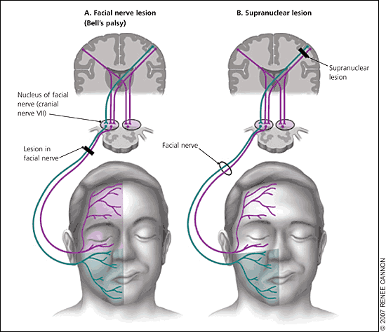
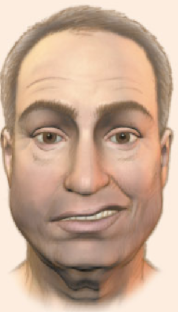
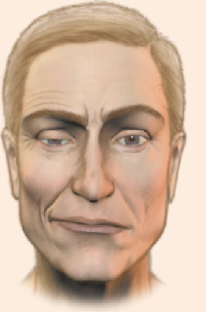

# Facialisparese
Q. Hvor kan læsioner befinde sig ved central facialisparese?
A. Centralt for nucl. faciais

Q. Hvor kan læsioner befinde sig ved perifær facialisparese?
A. Nucl. facialis eller perifært for

Q. Hvorfor vil læsioner i nucl. facialis give perifær facialisparese?
A. Overkrydsningen sker proksimalt for kernen, så en læsion i nucl. facialis = læsion i n. facialis.

Q. 

Hvilken læsion mistænker du?
A. Venstresidig central facialisparese (defekt nedre ansigt på højre side, ergo central skade på venstre side).

Q. 

Hvilken læsion mistænker du?
A. Højresidig perifær facialisparese

## Backlinks
* [[To explore without attention residue, keep depth sufficient]]
	* This is an argument for [[§Guide exploration]] and somewhat [[Balance exploration and specialisation]], but probably more in the minutes-hours scale than days-years. [[Facialisparese]].

<!-- #anki/tag/med/Neurology #anki/deck/Medicine -->

<!-- {BearID:6946420C-278E-474A-982B-FD10AAA2F13B-35709-00002A69C0250188} -->
