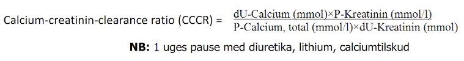
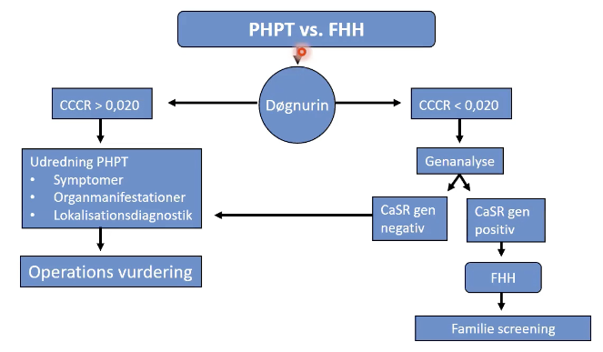

# Familiær hypocalciurisk hypercalcæmi (FHH)
## Generelt
Autosomal-dominant, let hypercalcæmi og lav calciumudskillelse i urin.

## Differentialdiagnose

## Udredning
### Anamnese
Q. Hvad er symptomerne på [[Familiær hypocalciurisk hypercalcæmi (FHH)]]?
A. Helt asymptomatisk.

### Objektiv us.

### Paraklinik
U Creatinin/Calcium ratio eller genetisk udredning.

## Behandling

## Opfølgning

## Prognose

## Backlinks
* [[Familiær hypocalciurisk hypercalcæmi (FHH)]]
	* Q. Hvad er symptomerne på [[Familiær hypocalciurisk hypercalcæmi (FHH)]]?
* [[Primær hyperparathyroidisme]]
	* Q. Hvad er den nærmest eneste differentialdiagnose til [[Primær hyperparathyroidisme]]?
* [[Hyperparathyroid hypercalcæmi]]
	* Q. Hvad er de primære årsager til [[Hyperparathyroid hypercalcæmi]]?

<!-- #anki/tag/med/Endocrinology #anki/deck/Medicine -->

<!-- {BearID:762113FD-8E74-44F4-B633-C7022FE235C7-23388-00003F4CEF7C9802} -->
