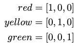

# Feature Engineering
Q. What does one-hot encoding mean?
A. Transforming a categorical variable into a vector with as many dimensions as the number of categories

Q. Which data-management process is this an example of?

A. One-hot encoding

Q. If you have a feature with categories [red, yellow, green], which process might you use to encode those in the dataset?
A. One-hot encoding

Q. If you have a categorical feature with categories [poor, good, better], which process might you use to encode those in the dataset?
A. Ordinal encoding [1, 2, 3]

Q. Why might we use binning for ML?
A. For a continuous variable, it “hints” to the algorithm that the rough category is what matters

Q. Why might we want to normalise data for machine learning?
A. 1) Faster speed of learning and 2) Decreased risk of numerical overflow 

Q. Why might normalising data lead to faster gradient descent?
A. Rather than features with large numbers dominating the gradients, each feature counts equally

Q. How does normalisation differ from standardisation?
A. Normalisation is standardising to a normal distribution

In which cases are [0,1] standardisation preferable to normalisation?
1) Unsupervised learning, 2) If the value is normally distributed and 3) With outliers

When might we prefer normalisation to [0,1] standardisation?
1) Supervised learning, 2) Values are not normally distributed and 3) No outliers

## Backlinks
* [[§Machine Learning]]
	* [[Feature Engineering]]

<!-- #anki/deck/ML -->

<!-- {BearID:C4D0F016-F2C8-4EF1-9317-1EF6571E6DAC-5010-00000EFBF50718D6} -->
