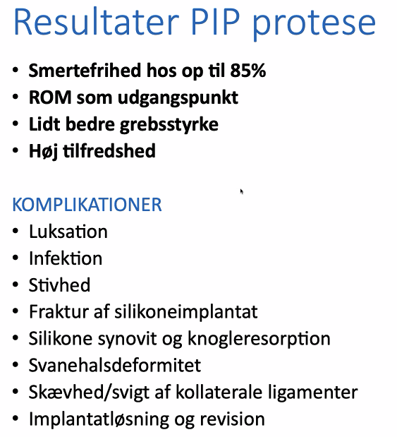

# Fingerartrose
[[§Artrose]], typisk symmetrisk (hvis primær) for hænder.

[[Rodledsartrose]]

## Differentialdiagnose

## Udredning
### Anamnese

### Objektiv us.

### Paraklinik

## Behandling
Q. Hvad menes med ortose?
A. Ekstern støtte (e.g. skinne)

Kan behandles med synovektomi, osteotomi, protese eller artrodese.

DIP: Artrodese

PIP: Meget gerne konservativt, vigtigere for håndfunktionen. Kan laves protese (silikone eller hård protese), bevarer den grad af bevægelighed, de har ved undersøgelsen. Mellem 7 og 15 % får komplikationer.

MP: Ligesom PIP. 

## Opfølgning

## Prognose

## Backlinks
* [[Rodledsartrose]]
	* En [[Fingerartrose]] i tommelfingerens grundled.
* [[Bevægeindskrænkning i fingre]]
	* [[Dupuytrens kontraktur]]
[[Fingerartrose]]

<!-- #anki/tag/med/Orto #anki/deck/Medicine -->

<!-- {BearID:54BC3EA9-4A1B-4DF2-A862-4D4E047D0835-4231-00001532A4AAC1E6} -->
