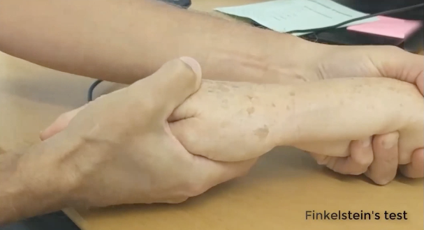

# Finkelsteins test
Q. Beskriv *[[Finkelsteins test]]* i håndleddet.
A. Grib om hånd, ulnardevier.

Q. Hvad tester *[[Finkelsteins test]]* for i håndleddet?
A. [[Mb. de Quervain]]

Q. Hvad er et abnormt resultat af *[[Finkelsteins test]]* i håndleddet?
A. Smerter i radialsiden af håndleddet

## Backlinks
* [[Mb. de Quervain]]
	* Q. Din patient viser symptomer på [[Mb. de Quervain]]. Hvad vil du tilføje *den objektive us.*? 
	* Q. Hvilken test er positiv ved [[Morbus de Quervain]]?
* [[Finkelsteins test]]
	* Q. Beskriv *[[Finkelsteins test]]* i håndleddet.

	* Q. Hvad tester *[[Finkelsteins test]]* for i håndleddet?
	* Q. Hvad er et abnormt resultat af *[[Finkelsteins test]]* i håndleddet?

<!-- #anki/tag/med/Orto #anki/deck/Medicine -->

<!-- {BearID:0F030FB4-6D8B-4F41-B7C3-18CBAAF2BFD8-15088-0000D7C257F323B6} -->
