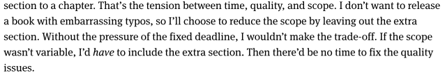

# Fixed time, variable scope	
# Fixed time, variable scope	
# Fixed time, variable scope	
# Fixed time, variable scope	
This allows you to prioritise and keep yourself flexible. You can choose between time, quality and scope. 

## Backlinks
* [[Validate the appetite]]
	* This is practically [[Fixed time, variable scope]] from [[Shape up]]. 

<!--      How much sense does this make for research? Probably a lot; scope creep is one of the big issues I hear when asking around on the halls. Instead, set a fixed time, and then whichever idea you have can potentially be added to future projects. -->

<!-- {BearID:BD714D25-F927-4C24-B193-0C51C3D0B162-22458-000034285DFC446C} -->
