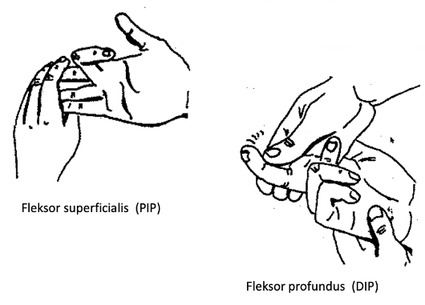
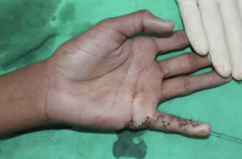

# Fleksorsenelæsioner i hånd
## Generelt
Q. Hvordan adskilles åbne og lukkede fleksorsenelæsioner?
A. Åbne har brud på hud, typisk pga. snit. Lukkede er pga. forceret ekstension, eg. hos klatrere.

## Differentialdiagnose

## Udredning
### Anamnese

### Objektiv us.
Q. Hvordan adskilles om det er fleksor superficialis eller profundus der er overrevet ved [[Fleksorsenelæsioner i hånd]]?
A. 

### Paraklinik

## Behandling
Q. Hvordan behandles lukkede fleksorsenelæsioner?
A. Fiksering af senen til afrivningspunktet

Q. Hvordan behandles åbne fleksorsenelæsioner?
A. Suturering af senen. Aktive småøvelser uden modstand allerede et par dage efter suturering.

Q. Hvor lang tid efter behandling af seneruptur kan en hånd belastes maksimalt?
A. 3 mdr, 6 mdr. hos håndværkere.

Q. Hvordan behandles en re-rumperet sene?
A. Senetransplantation

Q. Hvilken type incision bruges langs med finger?
A. Z-incision for at undgå kontraktur

## Opfølgning

## Prognose

Findes åbne eller lukkede. 

## Backlinks
* [[Fleksorsenelæsioner i hånd]]
	* Q. Hvordan adskilles om det er fleksor superficialis eller profundus der er overrevet ved [[Fleksorsenelæsioner i hånd]]?

<!-- #anki/tag/med/Orto #anki/deck/Medicine -->

<!-- {BearID:3521D9CC-D62C-4FBC-A0E7-09A7BBC7F7C8-53319-0000714802919363} -->
