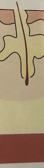

# Follikulitis
Q. Hvilken type infektion ses her?

A. [[Follikulitis]]

Q. Hvad menes i dermatologi med *[[Follikulitis]]*? 
A. *Betændelse i hårsæk*

Q. Hvad hedder *betændelse i hårsæk* i derma? 
A. *[[Follikulitis]]* 

Q. Du er i tvivl om din patient har [[Follikulitis]] eller en [[Furunkel]]. Hvordan adskiller du det? 
A. Spørg til almensymptomer

Q. Du er i tvivl om din patient har [[Follikulitis]] eller en [[Furunkel]]. Hvorfor er det vigtigt at adskille? 
A. [[Follikulitis]] behandles som [[Impetigo]], [[Furunkel]] som [[Abscess]], 

## Backlinks
* [[Furunkel]]
	* Q. Hvad menes i dermatologi med *[[Furunkel]]*? 
	* Q. Hvad hedder *dyb [[Follikulitis]]* i derma? 
* [[Follikulitis]]
	* Q. Hvilken type infektion ses her?
A. [[Follikulitis]]
	* Q. Hvad menes i dermatologi med *[[Follikulitis]]*? 
	* Q. Hvad hedder *betændelse i hårsæk* i derma? 
	* Q. Du er i tvivl om din patient har [[Follikulitis]] eller en [[Furunkel]]. Hvordan adskiller du det? 
	* Q. Du er i tvivl om din patient har [[Follikulitis]] eller en [[Furunkel]]. Hvorfor er det vigtigt at adskille? 
	* Q. Du er i tvivl om din patient har [[Follikulitis]] eller en [[Furunkel]]. Hvorfor er det vigtigt at adskille? 
* [[Infektioner i huden]]
	* [[S. aureus]]
	[[SSSS]]
	[[Erysipelas]]
	[[Ektyma]]
	[[Follikulitis]]
		[[Furunkel]]
			[[Karbunkel]]
	[[Cellulitis]]
	[[Nekrotiserende fasciitis]]

<!-- #anki/tag/med/Derma #anki/deck/Medicine #anki/tag/med/Infectious -->

<!-- {BearID:E90EBCDC-8B5F-469C-957D-FDA586F613ED-43570-0000512EEC4026F2} -->
