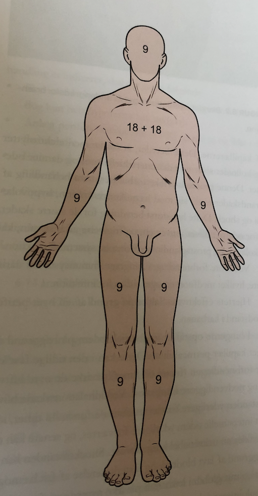

# Forbrænding 
## Generelt
Q. En patient har nedsat nyrefunktion dagen efter en forbrænding. Hvad skyldes det? 
A. 1) [[Akut nyresvigt (AKI)]] pga. hylovolæmi, 2) [[Akut tubulointerstitiel nefropati (ATIN)]] pga. giftstoffer fra vævsskaden

## Differentialdiagnose

## Udredning
### Anamnese

### Objektiv us.
Q. Hvordan estimeres brandsårsoverflade?
A. *Der skal kun medregnes 2. og 3. grads forbrændinger.* For- og bagside af truncus hver 18%. En håndflade svarer til 1%.

Q. Hvornår har en forbrændt 20-årig brug for I.V. væskebehandling?
A. 9%-reglen, hvis overstiger 20%

Q. Hvornår har en forbrænding 14-årig brug for I.V. væskebehandling?
A. 9%-reglen, hvis overstiger 10%

### Paraklinik

## Behandling
Q. Du skal modtage en forbrændt patient. Efter ABCDE- og traumevurdering, hvad vil du da gøre?
A. 1) Skyld med vand i mindst 30 minutter (gerne 3-4 timer, hvis hypotermi kan undgås), 2) Anlæg 2 PVK'er i ikke-forbrændte områder, 3) Estimér forbrændt område i % (kun 2. og 3. gradsforbrændinger) + Opstart væskebeh. hvis forbrænding > 20% voksne, 10% børn

## Opfølgning
Q. Du sidder i AP. Din patient har haft en forbrænding, der er bandageret og følges i brandsårsambulatoriet. Under hvilke omstændigheder skal han kontakte dem akut?
A. 1) Feber uden anden årsag, 2) Grim lugt, 3) Forbindingen bliver våd, strammer eller forskubber sig

Q. Du sidder i AP. Din patient har haft en forbrænding, der er bandageret og følges i brandsårsambulatoriet. Nu er den blevet våd. Hvad nu?
A. Kontakt brandsårsamb.

## Prognose
 

<!-- #anki/tag/med/Orto #anki/deck/Medicine #anki/tag/med/Acute care# -->

<!-- {BearID:8E4C1804-50BD-4DF4-B422-6D052067D7AC-54388-00008061799EBD5A} -->
