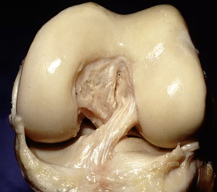

# Forreste korsbånd (ACL)
Q. Hvordan forløber forreste korsbånd (ACL)?
A. Posterolateralt på femur til anteromedialt på tibia.

<!-- #anki/deck/Medicine #anki/tag/med/Orto -->

<!-- {BearID:1C34EF57-8C99-41C5-8207-819BEE4E1DDE-15618-00001E681840587B} -->
