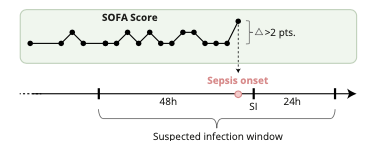
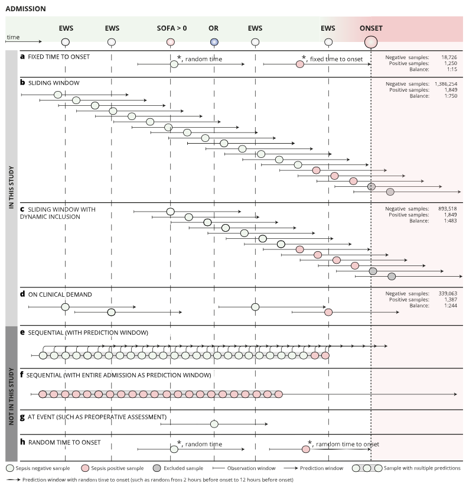
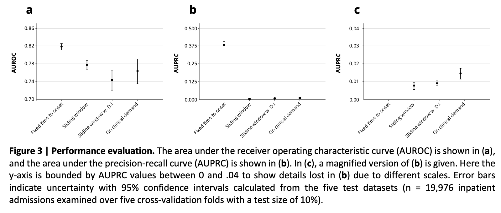
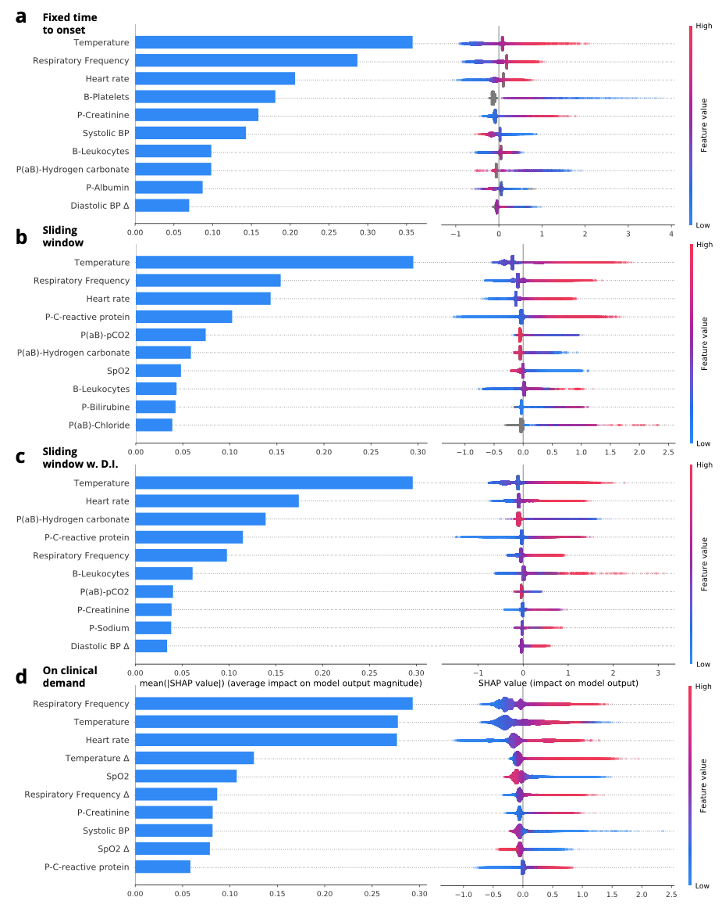
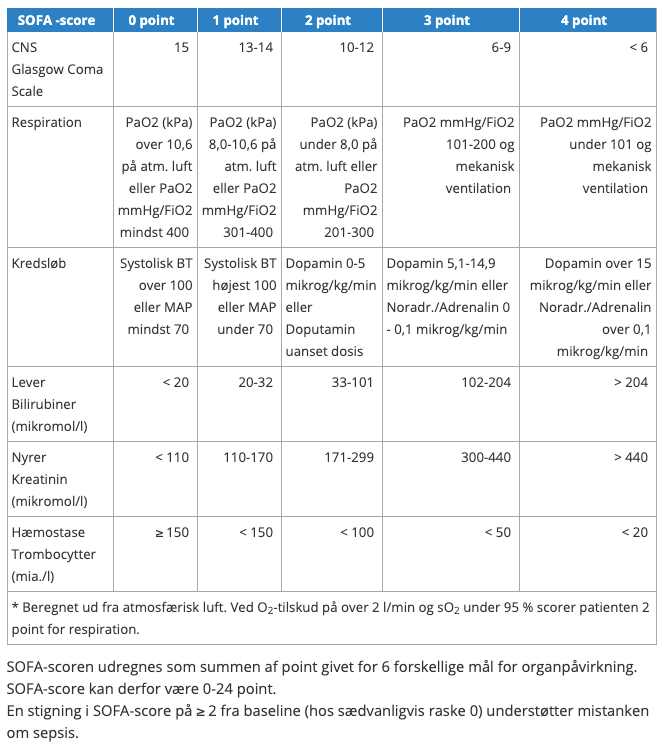
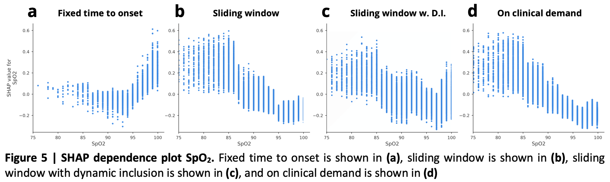

# Framing of ML problems
But very few machine learning models in healthcare are tested prospectively and clinically deployed [1–4].

the effect of censoring on risk predictions [5]

> Many aspects of the emerging AI technology are yet unknown to the end-user, the healthcare professional, who needs to comprehend the AI technology to ensure a genuine clinical translation.

> Could possibly lead to high false-positive rates and associated fatigue of the end-user. Real clinical translation can only be reached if this fatigue is avoided

## Methods
CROSS-tracks cohort, population based, open cohort
Primary and secondary healthcare partners
18+ Horsens Regionshospital. 
Sep 1 2012 til December 2018, 18+, hospitaliserede.
Skal være > 24 timer og < 50 dage.

The included admissions were distributed across 13,134 unique residents. The prevalence of sepsis among these admissions was 6.25%.

Udfald:
Mistanke om infektion
	1. Samples for culture +
	2. Antibiotika indenfor 72 timer efter eller 24 timer før.
*og*
	1. delta-SOFA på ≥ 2 point fra 48 timer før til 24 timer efter mistanke om infektion

XGBoost, typisk en ensemble af decision-trees.

Hvad er AUROC?

Hvor TPR = sensitivitet = recall og FPR = 1-specificitet

Hvad er AUPRC?

Hvor “precision = PPV” og “recall = sensitivitet”

AUPRC inddrager derfor prævalensen af udfaldet i ens dataset, men inddrager ikke “sandt negativer”. Hvis sens og spec er uændrede og > prævalensen, vil AUPRC blive større når prævalensen bliver større.

Og hvad er SOFA-scoren så?
*Bevidsthedsniveau (GCS)*
*Respiration*
*Kredsløb*
*Levertal*
*Nyretal*
*Thrombocytter*

De faktorer er, ikke så overraskende, også de faktorer der har de største mean[SHAP].

SHAP er et udtryk for, i hvor høj grad en given feature påvirker prædiktionen.

<!-- {BearID:E8DB78FA-B4C0-480C-8E1B-F4751E2E03CA-7959-000011CAF04F2EE8} -->
