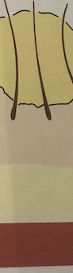

# Furunkel
[[Karbunkel]]

Q. Hvilken type infektion ses her?

A. [[Furunkel]]

Q. Hvad menes i dermatologi med *[[Furunkel]]*? 
A. *Dyb [[Follikulitis]]*

Q. Hvad hedder *dyb [[Follikulitis]]* i derma? 
A. *[[Furunkel]]* 

## Backlinks
* [[Furunkel]]
	* Q. Hvilken type infektion ses her?
A. [[Furunkel]]
	* Q. Hvad menes i dermatologi med *[[Furunkel]]*? 
	* Q. Hvad hedder *dyb [[Follikulitis]]* i derma? 
* [[Follikulitis]]
	* Q. Du er i tvivl om din patient har [[Follikulitis]] eller en [[Furunkel]]. Hvordan adskiller du det? 
	* Q. Du er i tvivl om din patient har [[Follikulitis]] eller en [[Furunkel]]. Hvorfor er det vigtigt at adskille? 
	* Q. Du er i tvivl om din patient har [[Follikulitis]] eller en [[Furunkel]]. Hvorfor er det vigtigt at adskille? 
* [[Otalgi]]
	* [[Øregang]]
	[[Otitis externa]]
	[[Cerumen]]
* [[Infektioner i huden]]
	* [[S. aureus]]
	[[SSSS]]
	[[Erysipelas]]
	[[Ektyma]]
	[[Follikulitis]]
		[[Furunkel]]
			[[Karbunkel]]
	[[Cellulitis]]
	[[Nekrotiserende fasciitis]]

<!-- #anki/tag/med/Derma #anki/deck/Medicine #anki/tag/med/Infectious -->

<!-- {BearID:8D31E00B-9932-40B2-94CE-88AB08042ADB-43570-0000512CB2589F69} -->
