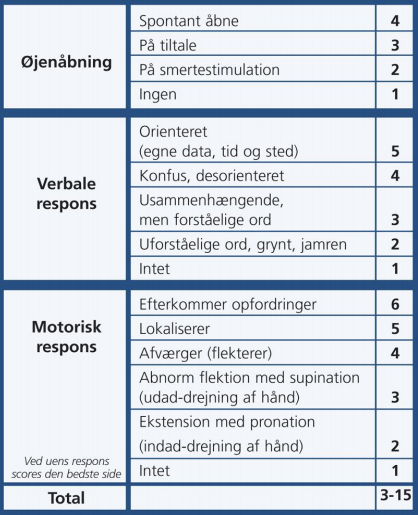

# GCS
Glasgow coma score.

## Backlinks
* [[Commotio cerebri]]
	* Der bruges algoritme (se [[Hovedtraume]]. Kan vurderes med [[GCS]].
	* Q. Din patient i AP har formentlig haft [[Commotio cerebri]], og var bevidstløs. Neurologisk US og [[GCS]] upåfaldende. Hvad nu?
* [[Hypercalcæmi]]
	* Q. Du mistænker din patient har *akut, labil hypercalcæmi*. s-Ca er forhøjet. Hvilken paraklinik igangsættes?
* [[ABCDE]]
	* Q. Hvilke faktorer indgår i vurdering af ABC*D*E?

<!-- #anki/tag/med/gp #anki/deck/Medicine -->

<!-- {BearID:24B97D43-D723-4228-B260-79997D57906D-3083-00000B726AECBC0E} -->
