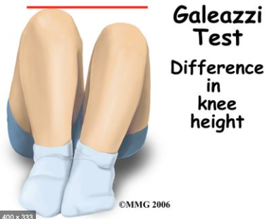

# Galeazzis tegn
Q. Beskriv en *[[Galeazzis tegn]]*.
A. 

Q. Hvad tester en *[[Galeazzis tegn]]* for?
A. *[[Kongenit hofteluksation]]*

Q. Hvilken test kan bruges til at teste for *[[Kongenit hofteluksation]]* i et 2-årigt barn?
A. *[[Galeazzis tegn]]*

Q. Hvilken test kan bruges til at teste for *[[Kongenit hofteluksation]]* i et spædbarn?
A. *[[Barlows test]]*

Q. Hvad er et abnormt resultat af en *[[Galeazzis tegn]]*?
A. Forskel i knæhøjde
 

## Backlinks
* [[Undersøgelse af knæ]]
	* [[Galeazzis tegn]]
* [[Galeazzis tegn]]
	* Q. Beskriv en *[[Galeazzis tegn]]*.

	* Q. Hvad tester en *[[Galeazzis tegn]]* for?
	* Q. Hvilken test kan bruges til at teste for *[[Kongenit hofteluksation]]* i et 2-årigt barn?
	* Q. Hvad er et abnormt resultat af en *[[Galeazzis tegn]]*?
* [[Us. af knæ]]
	* *Inspektion:*
* [[Det haltende barn]]
	* Q. Din patient er [[Det haltende barn]]. Hvad vil du tilføje *den objektive us.*? 

<!-- #anki/tag/med/Orto #anki/deck/Medicine -->

<!-- {BearID:609F0323-514F-4C4A-B823-C06DE5C4A0C1-819-0000035BCABDCED2} -->
