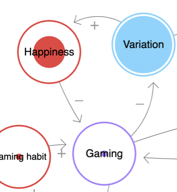

# Gaming and depression can become a positive feedback loop

This is part of the reason that [[Some games foster compulsion]].

[[§Gaming]]

## Backlinks
* [[Does gaming induce goal competition in my daily life]]
	* [[§Gaming]], [[Gaming and depression can become a positive feedback loop]]

<!-- #p1 -->

<!-- {BearID:C3F817C6-EC2C-415E-83C9-42DFA3BE00CB-261-000000532DE953C5} -->
