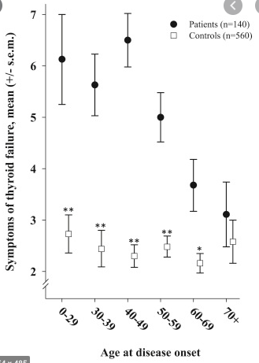

# Generelt om geriatriske patienter
[[Polyfarmaci]]

Q. Hvordan udvikler symptomspecificitet sig over alder?
A. Meget faldende! 

Q. Hvordan udføres rejse-sætte-sig-testen?
A. Rejse og sætte sig så mange gange som muligt indenfor 30 sekunder

Q. Hvad er a) et normalt resultat, og b) tab af funktion ved rejse-sætte-sig-testen?
A. a) 15 gange, b) under 9

Q. Hvad er den bedste prædiktor for øget faldrisiko?
A. Timed up and go

Q. Hvordan udføres timed up and go?
A. Sid på stol. Tid måles for at rejse sig, gå 3 meter ud, vende tilbage og sætte sig.

Q. Hvad er et abnormt resultat af timed up and go?
A. Over 15 sekunder

Q. En 75-årig er meget akut påvirket og har fået diagnosticeret UVI. På hvilken måde behandles?
A. *I.V.* antibiotika efter retningslinje, OBS: dårlig absorption af AB. Derudover optimer væske og ernæring.

Q. En 85-årig patient indlægges akut påvirket. Udover udredning for årsag, hvad skal man så være særligt opmærksom på?
A. 1) Delirrisiko, 2) Væske- og fødeindtag, OBS måling og evt. kateter., 3) Evt. binyrebarkinsufficiens, 4) Medicinindtag relativt til evt. AKI

Q. En 80-årig svækket patient indtager ikke tilstrækkeligt med væske. Hvad nu?
A. I rækkefølge 1) Nødning med væske, 2) Subkutan væske op til 1,5 l pr. dag, 3) I.V. væske

Q. Hvorfor bør nødning med væske være førstevalg ved [[Dehydrering]] hos ældre?
A. 1) Nedsat obstipationsrisiko, 2) Nedsat komplikationsrisiko ift. nåle

Q. En 85-årig kommer med tiltagende konfusion over de seneste 10 dage. Hvad skal altid tages?
A. Bredt blodbillede (inkl. TSH, HbA1c, elektrolytter), urin til D+R

<!-- #anki/tag/med/Geri #anki/deck/Medicine -->

<!-- {BearID:01DBBD10-4C90-402E-8797-62049153DA3A-15088-0000D227CC4D4DA8} -->
