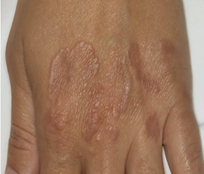

# Granuloma annulare
## Generelt

## Differentialdiagnose

## Udredning
### Anamnese
Sjældent kløende.

### Objektiv us.
Q. Beskriv eksantemet – Diagnose(r)?

A. Afgrænset erytematøst udslet, små elementer i randzonen - [[Granuloma annulare]]

Findes også i udbredte, disseminerede former.

### Paraklinik

## Behandling
Selvlimiterende. Kan behandles med cryoterapi eller [[Methotrexat]].

## Opfølgning
Tæt associeret til [[§Diabetes]], udredes derfor for dette.

## Prognose
Kan stå på i årevis.

<!-- #anki/tag/med/Derma #anki/deck/Medicine -->
## Backlinks
* [[Dermatofytose (tinea)]]
	* [[Granuloma annulare]]
* [[Granuloma annulare]]
	* Q. Beskriv eksantemet – Diagnose(r)?
A. Afgrænset erytematøst udslet, små elementer i randzonen - [[Granuloma annulare]]
* [[Tinea manum]]
	* [[Granuloma annulare]]

<!-- {BearID:A9AB8329-0E1E-4F05-91E9-C5917B524E33-4682-00000F5589C4B679} -->
