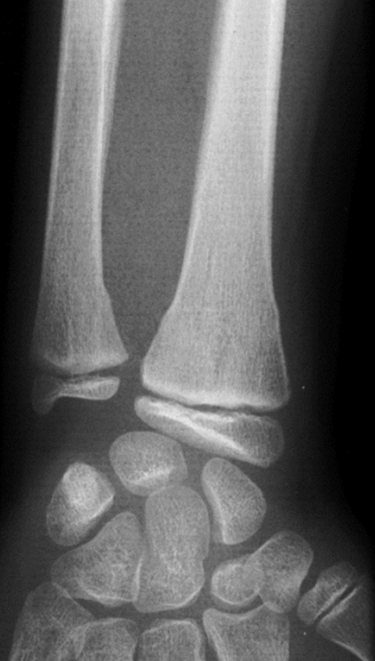
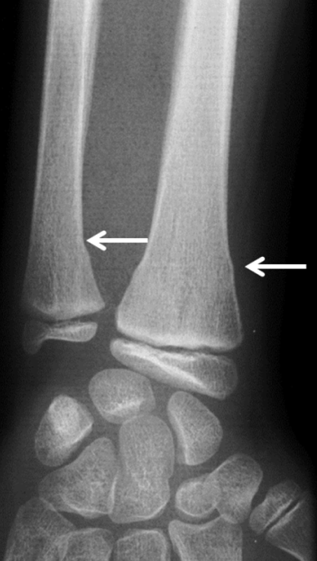
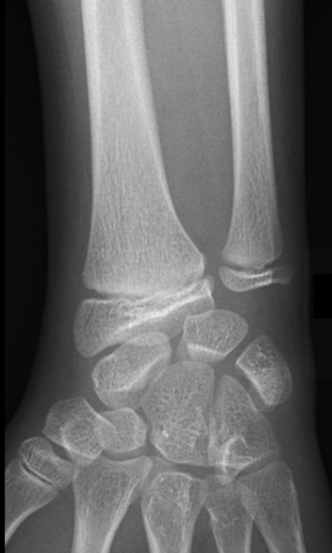
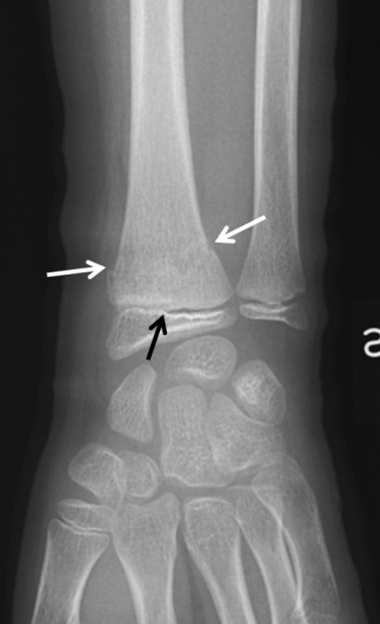
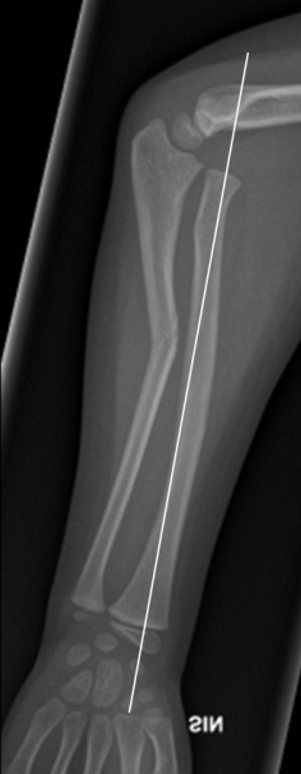

# Greenstick fraktur
## Generelt
Q. Hvad menes i sundhedsvæsenet med *[[Greenstick fraktur]]*? 
A. *Børnefraktur med periost-kontinuitet*

Q. Hvad hedder *Børnefraktur med periost-kontinuitet* i sundhedsvæsenet? 
A. *[[Greenstick fraktur]]* 

## Differentialdiagnose

## Udredning
### Anamnese

### Objektiv us.

### Paraklinik
Q. Hvad ses her?

A. Greenstick fraktur

Q. Hvad ses her?

A. Normale forhold

Q. Hvad ses her?

A. [[Epifysiolysefraktur]]

Q. Hvad ses her?

A. Greenstick-fraktur med [[Monteggia fraktur-dislokation]]

## Behandling

## Opfølgning

## Prognose

[[§Håndled]]

<!-- #anki/tag/med/Radiology #anki/deck/Medicine -->
## Backlinks
* [[§Håndled]]
	* [[Greenstick fraktur]]
* [[Greenstick fraktur]]
	* Q. Hvad menes i sundhedsvæsenet med *[[Greenstick fraktur]]*? 
	* Q. Hvad hedder *Børnefraktur med periost-kontinuitet* i sundhedsvæsenet?

<!-- {BearID:6F03C7EB-52B7-4726-A6B9-EFC45E113A64-80814-00012100F2D8EEA1} -->
