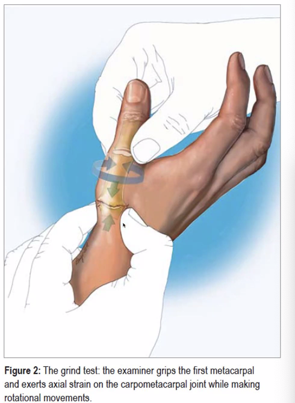

# Grinding test
Q. Beskriv en *[[Grinding test]]*.
A. 

Q. Hvad tester en *[[Grinding test]]* for?
A. *[[Rodledsartrose]]* i tommel

Q. Hvilken test kan bruges til at teste for *[[Rodledsartrose]]* i tommel?
A. *[[Grinding test]]*

Q. Hvad er et abnormt resultat af en *[[Grinding test]]*?
A. Smerter
 

## Backlinks
* [[Rodledsartrose]]
	* Q. Din patient viser symptomer på [[Rodledsartrose]]. Hvad vil du tilføje *den objektive us.*? 
* [[Grinding test]]
	* Q. Beskriv en *[[Grinding test]]*.
	* Q. Hvad tester en *[[Grinding test]]* for?
	* Q. Hvilken test kan bruges til at teste for *[[Rodledsartrose]]* i tommel?
	* Q. Hvad er et abnormt resultat af en *[[Grinding test]]*?
* [[Mb. de Quervain]]
	* Q. Din patient viser symptomer på [[Mb. de Quervain]]. Hvad vil du tilføje *den objektive us.*? 

<!-- #anki/tag/med/Orto #anki/deck/Medicine -->

<!-- {BearID:FC0C7487-D3DE-455F-9E5B-CC1F5AEC23A3-20983-00002429DCF1CE08} -->
