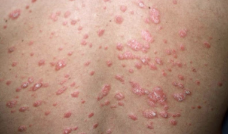

# Guttat psoriasis vulgaris
Q. Hvad menes i dermatologi med *[[Guttat psoriasis vulgaris]]*? 
A. *Akut psoriasis med 2-5 mm. papler*

Q. Hvad hedder *akut psoriasis med 2-5 mm. papler* i derma? 
A. *[[Guttat psoriasis vulgaris]]* 

Q. Hvad ses her?

A. [[Guttat psoriasis vulgaris]]

Q. Hvad udløser typisk [[Guttat psoriasis vulgaris]]?
A. Streptokokinfektion

Q. Hvordan udredes [[Guttat psoriasis vulgaris]]?
A. Halspodning

Q. Hvad er forløbet for [[Guttat psoriasis vulgaris]]? 
A. Efter fjernelse af udløsende faktor heler det op over måneder. Væsentligt forøget risiko for normal [[Psoriasis vulgaris]] efterfølgende.

Q. Hvilke autoimmune differentialdiagnoser findes til *[[Guttat psoriasis vulgaris]]*?
A. [[Pityriasis rosea]]

## Backlinks
* [[Psoriasis]]
	* Typer:
		[[Nummulat psoriasis vulgaris]]
		[[Plaque psoriasis vulgaris]]
		[[Guttat psoriasis vulgaris]]
		[[Intertriginøs psoriasis vulgaris]]
	[[Psoriasis pustulosa]]
		[[Pustulosis palmoplantaris]]
		[[Acrodermatitis continua Hallopeau]]
	[[Psoriasis i negle]]
	[[Psoriasisartrit]]
	[[Psoriasis erytroderma]]
* [[Guttat psoriasis vulgaris]]
	* Q. Hvad menes i dermatologi med *[[Guttat psoriasis vulgaris]]*? 
	* Q. Hvad hedder *akut psoriasis med 2-5 mm. papler* i derma? 
	* Q. Hvad ses her?
A. [[Guttat psoriasis vulgaris]]
	* Q. Hvad udløser typisk [[Guttat psoriasis vulgaris]]?
	* Q. Hvordan udredes [[Guttat psoriasis vulgaris]]?
	* Q. Hvad er forløbet for [[Guttat psoriasis vulgaris]]? 
	* Q. Hvilke autoimmune differentialdiagnoser findes til *[[Guttat psoriasis vulgaris]]*?

<!-- #anki/tag/med/Derma #anki/deck/Medicine -->

<!-- {BearID:30859B45-660B-4CA8-BF0D-371C04632D85-959-000005F0752C8B14} -->
