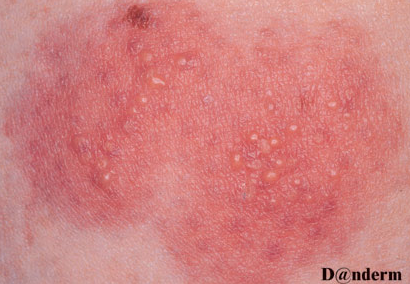
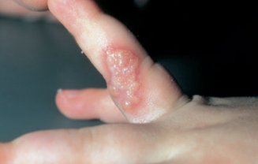

# HSV
## Generelt
Herpes simplex virus. Kan gives herpes genitalis (typisk [[HSV-2]].

Q. Beskriv eksantemet. Diagnoser?

A. Grupper af vesikler omgivet af erytem – e.g. [[HSV]]

Q. Beskriv eksantemet. Diagnoser?

A. Konfluerende vesikler omgivet af erytem – herpeti whitlow ved [[HSV]]

## Differentialdiagnose

## Udredning
### Anamnese

### Objektiv us.
Q. Beskriv *S* OCRATES for [[Primær herpesinfektion]] 
A. Mand) Præputium/glans. Kvinde) Labia

Q. Beskriv SO *C* RATES for [[Primær herpesinfektion]] 
A. Gruppe af vesikler, brister og danner smertefulde ulcera

Q. Beskriv SOCR *A* TES for [[Primær herpesinfektion]] 
A. Hævelse af regionale lymfeknuder. Få har alvorlige systemiske symptomer og feber

Q. Beskriv S *O* CRATES for [[Reaktiveret herpes]] 
A. Prodromale brændende, kløende områder

### Paraklinik

## Behandling
Q. En gravid kvinde i din praksis har primær [[HSV]]. Hvad nu?
A. Kontakt gyn, OBS neonatal herpes

Q. Din patient har haft [[Reaktiveret herpes]]. Hvad nu?
A. Medgiv acyclovir hjemme, begynd ved prodrom for at sænke symptomvarighed

## Opfølgning

## Prognose
## Backlinks
* [[HSV]]
	* Q. Beskriv eksantemet. Diagnoser?
A. Grupper af vesikler omgivet af erytem – e.g. [[HSV]]
	* Q. Beskriv eksantemet. Diagnoser?
A. Konfluerende vesikler omgivet af erytem – herpeti whitlow ved [[HSV]]
	* Q. En gravid kvinde i din praksis har primær [[HSV]]. Hvad nu?
* [[§Kønssygdomme]]
	* [[HPV]]
* [[Erythema multiforme]]
	* Q. Hvad er ætiologien for [[Erythema multiforme]]?
	* Q. Din patient har [[Erythema multiforme]]. Hvilke kategorier skal du mistænke?
	* Q. Hvad er den hyppigste årsag til [[Erythema multiforme]] i DK?
* [[Kønssygdom (i AP) (den venerologiske undersøgelse)]]
	* Q. Hvilken paraklinik indeholder en fuld venerologisk us.?

<!-- #anki/tag/med/Infectious #anki/deck/Medicine #anki/tag/med/GP -->

<!-- {BearID:D4BABAE9-6CEB-4F6B-A242-1C127C3ED9AE-906-00001A3E947A1194} -->
