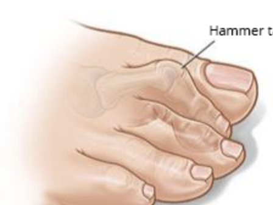
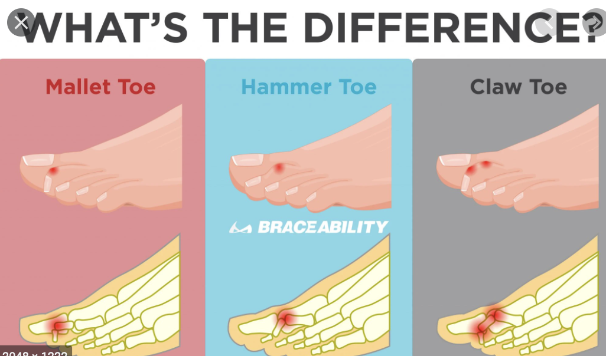

# Hammertå
Q. Hvad menes med hammertå?
A. Ekstension i MP, fleksion i PIP, ekstension i DIP

Q. Hvad menes med mallettoe?
A. Fleksion i DIP, ret i øvrige led

Q. Hvad menes med klotå?
A. Ekstension i MP-, fleksion i PIP- og DIP-led

Q. Hvad skyldes hammertå typisk? 
A. For småt fodtøj 

Q. Hvad skyldes klotå typisk?
A. Neurologiske udfald, eg. diabetisk neuropati

Q. Hvordan udredes for tå-deformiteter?
A. Klinik + rtg. (OBS: luksation)

Q. Hvad er behandlingen af tå-deformiteter?
A. Hyppigst konservativ (fodtøj, tåkapper), ved svære symptomer kirurgi (artrodese + forlængelse af relevante sener)

## Backlinks
* [[Diabetisk neuropati]]
	* Q. Hvad vil objektivt karakterisere den [[Diabetiske fod]]?

<!-- #anki/tag/med/Orto #anki/deck/Medicine -->

<!-- {BearID:2ADC576A-055F-45D7-A058-2BE2FCAA76D5-71605-00009F7D215FC3B5} -->
