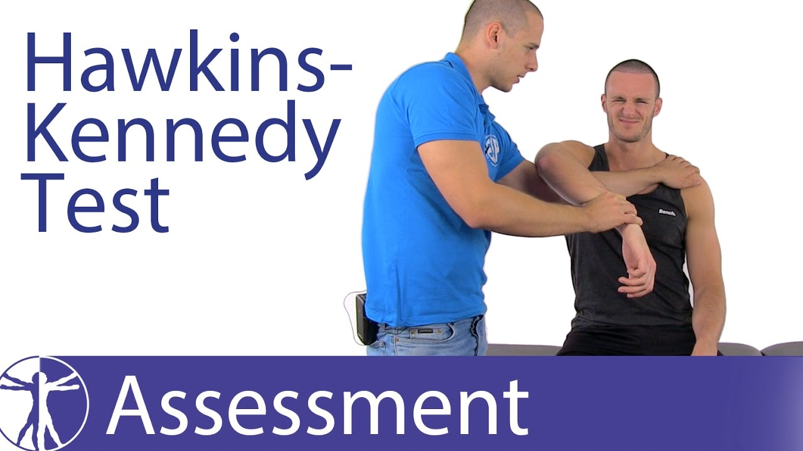

# Hawkins test
Q. Beskriv en *[[Hawkins test]]*.
A. 

Q. Hvad er et abnormt resultat af en *[[Hawkins test]]*?
A. Smerter

## Backlinks
* [[Hawkins test]]
	* Q. Beskriv en *[[Hawkins test]]*.
	* Q. Hvad er et abnormt resultat af en *[[Hawkins test]]*?
* [[Subacromialt impingement syndrom]]
	* Q. Hvilke test kan bruges til at teste for *[[Subacromialt impingement syndrom]]*?
* [[Neers test]]
	* Q. Hvilke test kan bruges til at teste for *[[Subacromialt impingement syndrom]]*?
* [[Undersøgelse af skulder]]
	* [[Hawkins test]]
* [[Us. af skulder]]
	* Ingen painful arc, neg. [[Hawkins test]], [[Neers test]], [[Empty can test]], udadrotationstest. 

<!-- #anki/tag/med/Orto #anki/deck/Medicine -->

<!-- {BearID:52303F86-D978-4A6F-B0DB-54C32F4B674E-51703-00006AA76E105B7F} -->
