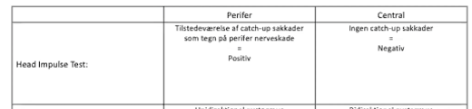

# Head Impulse Test
Q. Beskriv en *[[Head Impulse Test]]*.
A. Patient sidder overfor læge og fokuserer på næse. Lægen drejer patientens hoved til den ene side. Observerer øjenbevægelser.

Q. Hvad tester en *[[Head Impulse Test]]* for?
A. *[[VOR]]* (hyppigt [[Neuritis vestibularis]]).

Q. Hvilken test kan bruges til at teste for *[[Neuritis vestibularis]]*?
A. *[[Head Impulse Test]]*

Q. Hvad er et abnormt resultat af en *[[Head Impulse Test]]*?
A. Forsinket re-fokus på undersøgerens øjne

Q. Hvad tyder et abnormt resultat af en [[Head Impulse Test]] på?
A. Perifær nerveskade i [[VOR]]

## Backlinks
* [[Head Impulse Test]]
	* Q. Beskriv en *[[Head Impulse Test]]*.
	* Q. Hvad tester en *[[Head Impulse Test]]* for?
	* Q. Hvilken test kan bruges til at teste for *[[Neuritis vestibularis]]*?
	* Q. Hvad er et abnormt resultat af en *[[Head Impulse Test]]*?
	* Q. Hvad tyder et abnormt resultat af en [[Head Impulse Test]] på?
* [[Neuritis vestibularis]]
	* [[Head Impulse Test]].
* [[Svimmelhed]]
	* Q. Din patient viser symptomer på [[Svimmelhed]]. Hvad vil du tilføje *den objektive us.*? 

<!-- #anki/deck/Medicine #anki/tag/med/Otolarynghology -->

<!-- {BearID:A94D9E3A-7385-40A8-99E0-F4BA582CF44B-65488-00007021FB5B6DA2} -->
