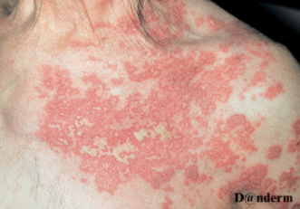
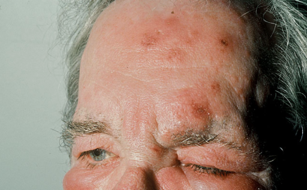

# Herpes zoster
## Generelt
Q. Hvilket agens udløser [[Herpes zoster]]?
A. [[VZV]]

Q. Beskriv eksantemet. Diagnose(r)?

A. Konfluerende vesikler med udbredt erytem og skældannelse afgrænset til dermatomer sin. - [[Herpes zoster]]

Q. Beskriv eksantemet – Diagnose(r)?

A. Nodulo-papulære elementer med erytem og skældannelse afgrænset til n. oftalmicus sin. - [[Herpes zoster]]

## Differentialdiagnose

## Udredning
Q. Beskriv *S* OCRATES for [[Herpes zoster]] 
A. Svarende til et dermatom

Q. Beskriv SO *C* RATES for [[Herpes zoster]] 
A. Brændende, kløende

Q. Din patient har sit første [[Herpes zoster]] tilfælde. Hvor mange gange, skal pt. forvente at få reaktivering? 
A. Typisk ikke igen, men kan ses.

## Behandling

## Opfølgning

## Prognose

<!-- #anki/deck/Medicine #anki/tag/med/Derma -->

## Backlinks
* [[Herpes zoster]]
	* Q. Hvilket agens udløser [[Herpes zoster]]?
	* Q. Beskriv eksantemet. Diagnose(r)?
A. Konfluerende vesikler med udbredt erytem og skældannelse afgrænset til dermatomer sin. - [[Herpes zoster]]
	* Q. Beskriv eksantemet – Diagnose(r)?
A. Nodulo-papulære elementer med erytem og skældannelse afgrænset til n. oftalmicus sin. - [[Herpes zoster]]
	* Q. Beskriv *S* OCRATES for [[Herpes zoster]] 
	* Q. Beskriv SO *C* RATES for [[Herpes zoster]] 
	* Q. Din patient har sit første [[Herpes zoster]] tilfælde. Hvor mange gange, skal pt. forvente at få reaktivering? 
	* [[Herpes zoster]]
	* Q. Hvilket agens udløser [[Herpes zoster]]?
	* Q. Beskriv eksantemet. Diagnose(r)?
	* Q. Beskriv eksantemet – Diagnose(r)?
	* Q. Beskriv *S* OCRATES for [[Herpes zoster]] 
	* Q. Beskriv SO *C* RATES for [[Herpes zoster]] 
	* Q. Din patient har sit første [[Herpes zoster]] tilfælde. Hvor mange gange, skal pt. forvente at få reaktivering? 
	* 5% andre (eg. [[Herpes zoster]]).
* [[Akutte brystsmerter]]
	* Q. Hvilke *infektiøse* differentialdiagnoser findes til [[Akutte brystsmerter]]?
* [[Brystsmerter]]
	* 5% andre (eg. [[Herpes zoster]]).
* [[Spot-test]]
	* Q. Hvad ses her?
A. [[Herpes zoster]]

## Backlinks
* [[Herpes zoster]]
	* Q. Hvilket agens udløser [[Herpes zoster]]?
	* Q. Beskriv eksantemet. Diagnose(r)?
A. Konfluerende vesikler med udbredt erytem og skældannelse afgrænset til dermatomer sin. - [[Herpes zoster]]
	* Q. Beskriv eksantemet – Diagnose(r)?
A. Nodulo-papulære elementer med erytem og skældannelse afgrænset til n. oftalmicus sin. - [[Herpes zoster]]
	* Q. Beskriv *S* OCRATES for [[Herpes zoster]] 
	* Q. Beskriv SO *C* RATES for [[Herpes zoster]] 
	* Q. Din patient har sit første [[Herpes zoster]] tilfælde. Hvor mange gange, skal pt. forvente at få reaktivering? 
* [[Akutte brystsmerter]]
	* Q. Hvilke *infektiøse* differentialdiagnoser findes til [[Akutte brystsmerter]]?
* [[Brystsmerter]]
	* 5% andre (eg. [[Herpes zoster]]).

<!-- {BearID:285D2872-CF7C-48BE-801E-764F267CFC1D-3083-00000F8D65074D59} -->
