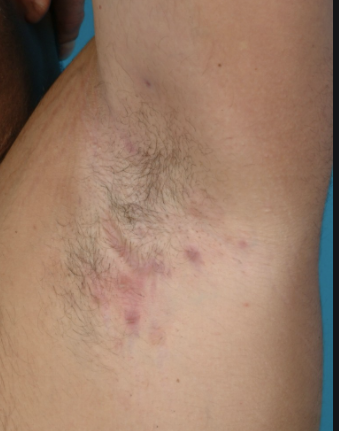

# Hidrosadenitis suppurativa
## Generelt
Q. Hvad menes i sundhedsvæsenet med *[[Hidrosadenitis suppurativa]]*? 
A. *Ardannende inflammation omkring intertriginøse hårfollikler*

Q. Hvad hedder *ardannende inflammation omkring intertriginøse hårfollikler* i sundhedsvæsenet? 
A. *[[Hidrosadenitis suppurativa]]* 

Sværhedsgrad fra let til langvarig.

Q. Hvad er mekanismen bag [[Hidrosadenitis suppurativa]]?
A. Hyperkeratose lukker folliklerne -> Abscesdannelse.

## Differentialdiagnose
Q. Hvad er de diagnostiske kriterier for [[Hidrosadenitis suppurativa]]?
A. 1) Recidiverende, 2) Sterile abscesser, 3) Intertriginøst

Q. Hvad ses her?

A. Kan være flere ting: [[Abscess]], [[Hidrosadenitis suppurativa]]

## Udredning
### Anamnese

### Objektiv us.
Q. Din patient har [[Hidrosadenitis suppurativa]] i aksil. Hvad vil du tilføje til den objektive us.?
A. Undersøge under mammae, lyske og crena ani.

### Paraklinik
Q. Q. Din patient viser symptomer på [[Hidrosadenitis suppuritiva]]. Hvad vil du tilføje til *paraklinikken*? 
A. 1) Podninger, OBS infektiøs ddx

## Behandling
Initielt lokalt med [[Benzoylperoxid]]. 

Ved abscesser intralæsionel steroid.

Længerevarende systemisk tetracyklin kan hjælpe nogle.

De-roofing.

## Opfølgning

## Prognose

## Backlinks
* [[Hidrosadenitis suppurativa]]
	* Q. Hvad menes i sundhedsvæsenet med *[[Hidrosadenitis suppurativa]]*? 
	* Q. Hvad hedder *ardannende inflammation omkring intertriginøse hårfollikler* i sundhedsvæsenet? 
	* Q. Hvad er mekanismen bag [[Hidrosadenitis suppurativa]]?
	* Q. Hvad er de diagnostiske kriterier for [[Hidrosadenitis suppurativa]]?
	* Q. Hvad ses her?
A. Kan være flere ting: [[Abscess]], [[Hidrosadenitis suppurativa]]
	* Q. Din patient har [[Hidrosadenitis suppurativa]] i aksil. Hvad vil du tilføje til den objektive us.?

<!-- #anki/tag/med/Derma #anki/deck/Medicine -->

<!-- {BearID:121D72C0-65F1-43F1-A0C9-4E3000C04B62-84084-0000A1521F646859} -->
