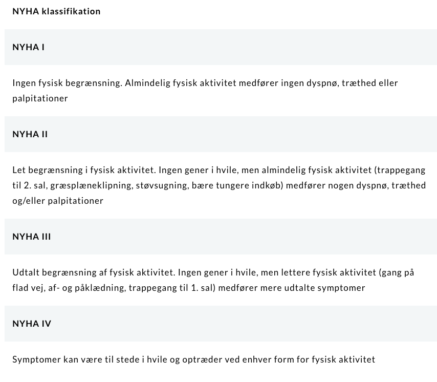

# Hjerteinsufficiens
NBV: [Behandlingsvejledning | Kronisk hjertesvigt](https://nbv.cardio.dk/chf)

# Generelt
Er et *klinisk syndrom*, der opstår på baggrund af enten strukturel eller funktionelle kardiel insufficiens.

# Diagnose
Q. Hvilke symptomer har en patient typisk på [[Hjerteinsufficiens]]?
A. 1) Træthed, 2) [[Dyspnø]], evt. 3) Palpitationer

Q. Hvilke objektive fund vil tyde på *[[Hjerteinsufficiens]]*? 
A. 1) [[Halsvenestase]], 2) Krepitation ved [[St. p.]], 3) [[Ascites]], 4) [[Deklive ødemer]]

Q. Din patient er træt, og du mistænker [[Hjerteinsufficiens]]. Hvad skal tilføjes den objektive us?
A. 1) BT, 2) [[Halsvenestase]], BT, 3) Hjerte- og lungestetoskopi, 4) Inspektion for deklive ødemer

[[Ekkokardiografi]]

Q. Din patient har en ret høj risiko for at lide af [[Hjerteinsufficiens]]. Hvad nu?
A. Henvis til hospital i pakkeforløb

# Behandling

# Opfølgning

# Prognose

<!-- #anki/tag/med/Cardiology #anki/deck/Medicine -->

## Backlinks
* [[Hjerteinsufficiens]]
	* Q. Hvilke symptomer har en patient typisk på [[Hjerteinsufficiens]]?
	* Q. Hvilke objektive fund vil tyde på *[[Hjerteinsufficiens]]*? 
	* Q. Din patient er træt, og du mistænker [[Hjerteinsufficiens]]. Hvad skal tilføjes den objektive us?
	* Q. Din patient har en ret høj risiko for at lide af [[Hjerteinsufficiens]]. Hvad nu?
* [[§Hyponatriæmi]]
	* Q. Hvilke differentialdiagnoser findes til [[Overhydreret hyponatriæmi]]?
* [[Akut dyspnø]]
	* Q. Hvilke *vaskulære* differentialdiagnoser findes til [[Akut dyspnø]]?
* [[Kronisk dyspnø]]
	* Q. Hvilke *vaskulære* differentialdiagnoser findes til [[Kronisk dyspnø]]?
* [[Træthed]]
	* [[§Anæmi]]
* [[Kronisk hoste]]
	* Q. Hvilke *vaskulære* differentialdiagnoser findes til [[Kronisk hoste]]?
* [[Sekundær hyperaldosteronisme]]
	* Q. Hvad er mekanismen bag [[Sekundær hyperaldosteronisme]]?
* [[Lungeødem]]
	* Typisk pga. akut [[Hjerteinsufficiens]].
* [[Bensår]]
	* Q. Hvilke *vaskulære* differentialdiagnoser findes til [[Bensår]]?
* [[Respirationsinsufficiens]]
	* Q. Hvordan vil du objektivt præhospitalt adskille en patient med [[Sepsis]] fra [[Hjerteinsufficiens]]?

<!-- {BearID:C31E655F-888A-4DE2-A6BE-FF1FB4DB5BEE-21575-00002BC27EEB9DDA} -->
