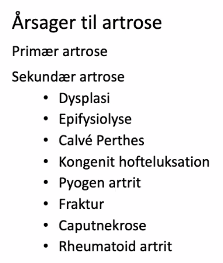

# Hofteartrose
[[§Artrose]] i [[§Hofte]].

## Generelt
Q. Hvilke årsager er der til sekundær hofteartrose?
A. 1) Infektioner, 2) Traumer, 3) Autoimmune ledsygdomme, 4) Metaboliske knoglesygdomme, 5) Kongenitte etc. (VITAMINS)

## Differentialdiagnose
Q. Hvilke vaskulære differentialdiagnoser findes til hofteartrose?
A. [[Vaskulær claudicatio]]

Q. Hvilke idiopatiske differentialdiagnoser findes til hofteartrose?
A. [[Kroniske lumbale rygsmerter (lumbago)]]

Q. Hvilke traumatiske differentialdiagnoser findes til hofteartrose?
A. [[Lumbal diskusprolaps]], [[Lumbal spinalstenose]]

Q. Hvilke congenitte differentialdiagnoser findes til hofteartrose?
A. [[Hoftedysplasi]]

## Udredning
### Anamnese
Q. Hvad er de dominerende symptomer ved hofteartrose?
A. Smerter og nedsat bevægelighed

Q. Hvordan ændres funktionen ved hofteartrose?
A. Nedsat gangdistance

Q. Beskriv smerterne ved hofteartrose
A. S: Vagt omkring hoften eller i knæet, O: Ved igangsætning, E: Bedres efter kort tid, forværres igen ved kontinuert belastning

Har også [[C-sign]] som [[Hoftedysplasi]].

### Objektiv us.
Q. Hvilke objektive fund findes ved hofteatrose?
A. 1) Atrofi, 2) Nedsat kraft ([[Trendelenburgs test]]), 3) Nedsat mobilitet.

Q. Hvilke(n) objektiv(e) test kan bruges ved hofteartrose?
A. [[Trendelenburgs test]]

### Paraklinik
Q. Hvordan diagnosticeres hofteartrose?
A. Klinik + rtg. Hvis rtg. neg. men tydelig klinik, overvej MR.

Q. En pt. har klinik til hofteartrose, men rtg. er negativ. Hvad nu? 
A. MR. Hvis neg., diff. diag.

## Behandling
Q. Hvordan behandles hofteatrose?
A. Trin 1) Fysisk træning, vægttab. Trin 2) Svage analgetika, evt. stok. Trin 3) [[Hoftealloplastik]]. 

## Opfølgning

## Prognose

## Backlinks
* [[Hoftealloplastik]]
	* Behandling af [[Hofteartrose]].
* [[Hoftedysplasi]]
	* DDX
	[[Lumbal spinalstenose]]
	[[Hofteartrose]]
	* Q. Du beder din patient beskrive, hvor hoftesmerterne sidder, og de gør sådan her:
Hvad mistænker du?
A. [[Hoftedysplasi]] eller [[Hofteartrose]], OBS [[C-sign]].
	* Hyppig årsag til [[Hofteartrose]]. 
* [[§Hofte]]
	* [[Hofteartrose]]

<!-- #anki/tag/med/Orto #anki/deck/Medicine -->

<!-- {BearID:C0315274-165E-4E43-8308-AF4BADA1AD96-9907-00007B5AEAE444B7} -->
