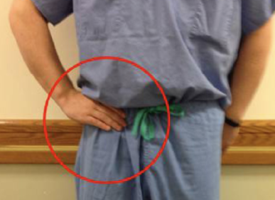
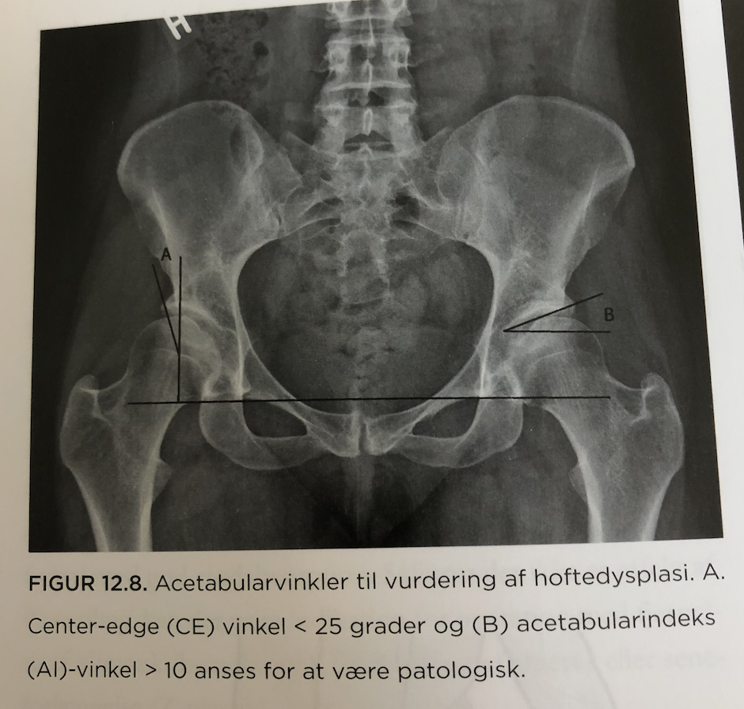
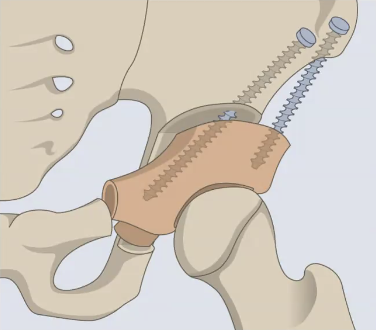
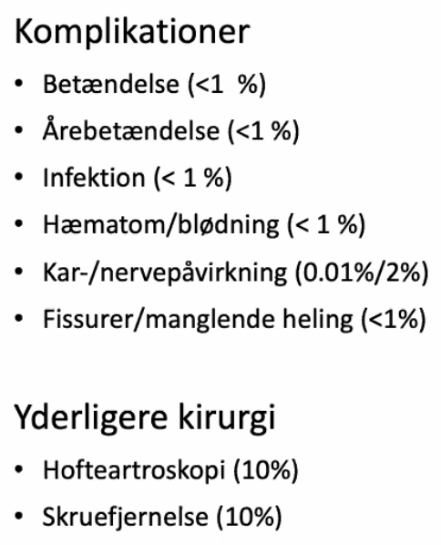

# Hoftedysplasi
## Generelt
300 p.a. opereres i DK. Ca. 5% af befolkningen har det.

En stor del af smertemekanismen er gentagne traumer på ledlæben, da denne superiort sidder mere medialt. 

## Differentialdiagnose
Primær
Sekundær
	[[Hofteepifysiolyse]]
	[[Mb. Calve-Legg-Perthe]]
	[[Kongenit hofteluksation]]
	[[Caputnekrose]]
	[[Oligohydramnios]]

DDX
	[[Discusprolaps]]
	[[Lumbal spinalstenose]]
	[[Hofteartrose]]

	Bløddelsproblematik
		[[Iliopsoas tendinit]]

## Udredning
### Anamnese
Q. Hvor sidder smerterne typisk ved [[Hoftedysplasi]]?
A. I lysken. Hvis i balle/ryg, tænk DDX ([[Discusprolaps]], [[Lumbal spinalstenose]]).

Q. Hvor udstråler smerter fra [[Hoftedysplasi]] typisk til?
A. Forside af lår/knæ

Smerter bør kun være ensidige, og bør ikke være i balle/ryg.

### Objektiv us.
Q. Du beder din patient beskrive, hvor hoftesmerterne sidder, og de gør sådan her:

Hvad mistænker du?
A. [[Hoftedysplasi]] eller [[Hofteartrose]], OBS [[C-sign]].

### Paraklinik
Q. Din patient viser symptomer på [[Hoftedysplasi]]. Hvad vil du tilføje til *paraklinikken*? 
A. Voksen: 1) Rtg. hofte, suppler evt. med 2) CT/MR. Barn: UL.

    

Q. Hvad er en abnorm CE-vinkel?
A. < 25 grader
    

Q. Hvad menes med CE-vinkel?
A. Center-edge vinkel. En vinkel mellem lodretlinje gennem caput femoris og en linje fra centrum af caput femoris til lateralkanten af acetabulum (A nedenfor). 
    

Q. Hvad er en abnorm acetabularindeks-vinkel?
A. Over 10 grader
    

Q. Hvad menes med acetabularindeks-vinklen (AI)?
A. En vinkel i centrum af acetabulum mellem vandret og lateralkanten af acetabulum.

## Udredning

## Behandling
Q. Under hvilke omstændigheder behandles [[Hoftedysplasi]]?
A. Altid hvis kongenit. Ellers NRS 3 i hvile, 7 i aktivitet.

Q. Hvordan behandles [[Hoftedysplasi]]?
A. Konservativt: fysioterapi og træning. Hvis utilstrækkeligt, operation (PAO).

Fjerner den laterale, superiore belastning nær ledlæben.

Børn opereres anderledes, for at undgå epifysen i hoften (som ligger lige omkring acetabulum).

Artroskopi hvis ledlæben ikke heler ordentligt på.

## Opfølgning

## Prognose

N. cutaneus femoris lateralis læderes næsten obligat.

Hyppig årsag til [[Hofteartrose]]. 

## Backlinks
* [[Hofteartrose]]
	* Q. Hvilke congenitte differentialdiagnoser findes til hofteartrose?
	* Har også [[C-sign]] som [[Hoftedysplasi]].
* [[Hoftedysplasi]]
	* Q. Hvor sidder smerterne typisk ved [[Hoftedysplasi]]?
	* Q. Hvor udstråler smerter fra [[Hoftedysplasi]] typisk til?
	* Q. Du beder din patient beskrive, hvor hoftesmerterne sidder, og de gør sådan her:
Hvad mistænker du?
A. [[Hoftedysplasi]] eller [[Hofteartrose]], OBS [[C-sign]].
	* Q. Din patient viser symptomer på [[Hoftedysplasi]]. Hvad vil du tilføje til *paraklinikken*? 
	* Q. Under hvilke omstændigheder behandles [[Hoftedysplasi]]?
	* Q. Hvordan behandles [[Hoftedysplasi]]?
* [[§Hofte]]
	* [[Hoftedysplasi]]
* [[Kongenit hofteluksation]]
	* [[Hoftedysplasi]]
* [[Det haltende barn]]
	* [[Hoftedysplasi]]
* [[Klumpfod]]
	* Q. Et nyfødt barn har fået diagnosticeret klumpfod. Hvad skal igangsættes inden udskrivelse?
* [[Rotation af børns underben]]
	* Q. Du ser et barn med [[In-toeing]] i almen praksis. Hvornår er der indikation for henvisning?

<!-- #anki/tag/med/Orto #anki/deck/Medicine -->

<!-- {BearID:6AAE2A56-EADB-4954-9A4C-49EF3130051E-98900-0000C152C15EC2EB} -->
