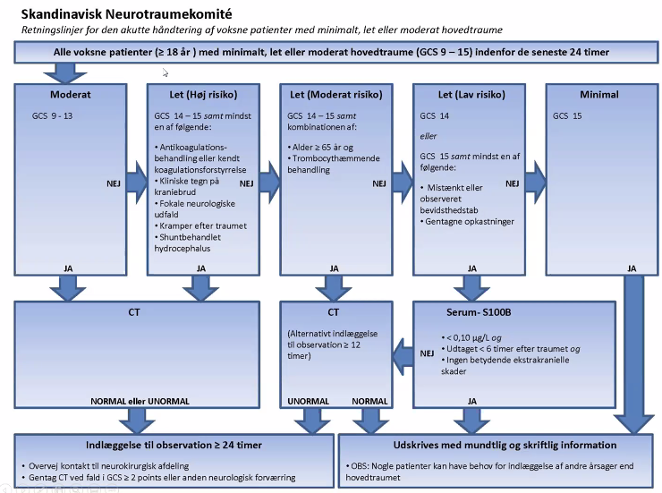

# Hovedtraume
## Generelt

## Differentialdiagnose

## Udredning
### Anamnese

### Objektiv us.

### Paraklinik

## Behandling

## Opfølgning
Observationsintervaller ved hovedtraume er (forskellige alt efter instruks):
Første 2 timer: Hvert kvarter
4-8 timer: Hver halve time
8-24 timer: Hver time

## Prognose

## Backlinks
* [[Commotio cerebri]]
	* Der bruges algoritme (se [[Hovedtraume]]. Kan vurderes med [[GCS]].
* [[Svimmelhed]]
	* Q. Hvilke *traumatiske* differentialdiagnoser findes til [[Vertigo]]?

<!-- #anki/deck/Medicine #anki/tag/med/Acute care# -->

<!-- {BearID:E239C073-D396-41A1-9E79-7B5460D8ACC4-86299-0001338A90A7ECF0} -->
