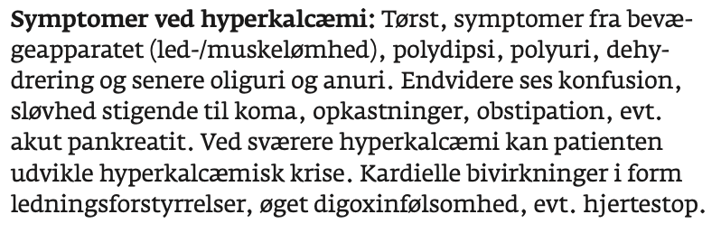
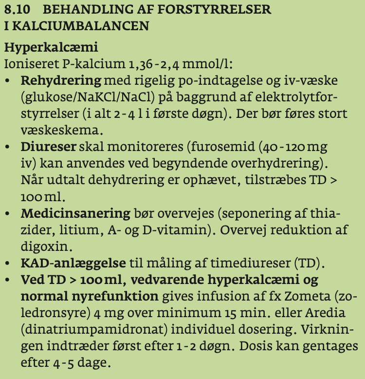
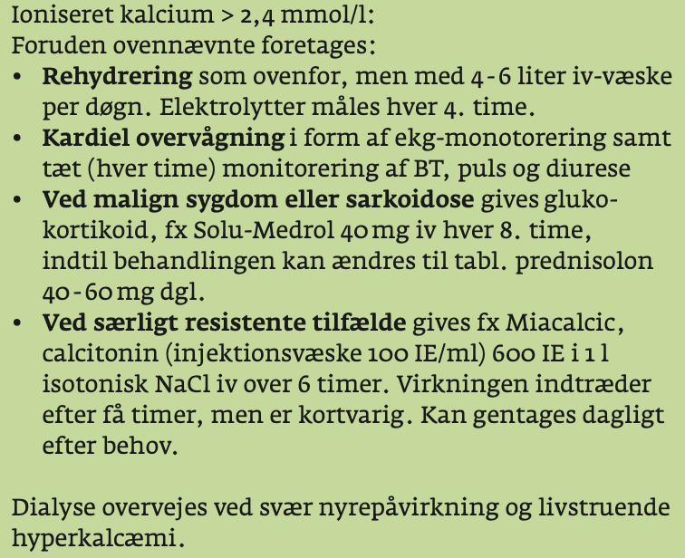

# Hypercalcæmi
Det modsatte af [[Hypocalcæmi]].

## Generelt
Q. Hvordan opdeles [[Hypercalcæmi]] overordnet ætiologisk?
A. 1) [[Hyperparathyroid hypercalcæmi]] og 2) [[Non-parathyroid hypercalcæmi]]

Q. Hvad er den vigtigste blodprøve til ætiologisk klassificering af *kronisk, stabil hypercalcæmi*?
A. [[PTH]]

## Differentialdiagnose
## Udredning

Q. Hvilke organsystemer påvirkes ved [[Hypercalcæmi]]?
A. CNS, hjertet, GI, nyre, bevægeapparat

### Anamnese
Q. Din patient viser symptomer på [[Hypercalcæmi]]. Hvad skal tilføjes *anamnesen*? 
A. 1) Ændret psykiatri, 2) Obstipation, 3) Polyuri/polydipsi, 4) Muskelsvaghed

### Objektiv us.

### Paraklinik
Q. Du mistænker din patient har *akut, labil hypercalcæmi*. s-Ca er forhøjet. Hvilken paraklinik igangsættes?
A. 0) [[GCS]]-monitorering, 1) [[Telemetri]], 2) [[Kateter]]

Q. Du mistænker din patient har *kronisk, stabil hypercalcæmi*. s-Ca er forhøjet. Hvilken paraklinik tager du?
A. 1) [[PTH]], 2) [[EKG]], 3) [[BT]], 4) Genetisk udredning (familiær, evt. MEN-1) – hvis mistanke om toxicitet, [[D-vitamin]]/[[A-vitamin]]

## Behandling

Q. Din patient har *akut, labil* [[Hypercalcæmi]]. Hvad er den akutte behandling?
A. 1) Anlæg god IV adgang, 2) 3-4L væske pr. dag, 3) [[Calcitonin]]. Derudover alt efter tilgrundliggende årsag. Undgå [[Furosemid]], OBS udfældning i nyre.

## Opfølgning

## Prognose

## Backlinks
* [[Hyperparathyroidisme]]
	* Q. Din patient viser symptomer på [[Hyperparathyroidisme]]. Hvad skal tilføjes *anamnesen*? 
* [[Hypercalcæmi]]
	* Q. Hvordan opdeles [[Hypercalcæmi]] overordnet ætiologisk?
	* Q. Hvilke organsystemer påvirkes ved [[Hypercalcæmi]]?
	* Q. Din patient viser symptomer på [[Hypercalcæmi]]. Hvad skal tilføjes *anamnesen*? 
	* Q. Din patient har *akut, labil* [[Hypercalcæmi]]. Hvad er den akutte behandling?
* [[Non-parathyroid hypercalcæmi]]
	* Q. Hvordan kan cancer give labil [[Hypercalcæmi]]?
	* Q. Din patient har [[Hypoparathyroid hypercalcæmi]]. Hvad er behandlingen?

<!-- #anki/tag/med/Endocrinology #anki/deck/Medicine -->

<!-- {BearID:914BD592-9DD3-4FA3-B6AB-9CC871C6A57E-23388-00003DEDCE692EF3} -->
